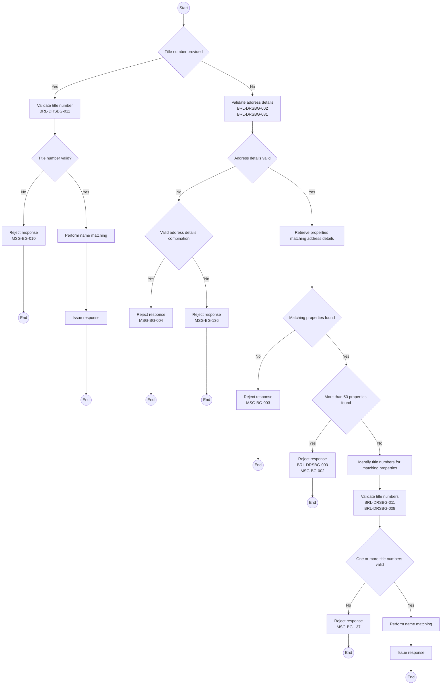

<!-- cspell:words DRSBG -->

# Online Owner Verification Process

```mermaid
graph TD
    Start((Start)) --> TitleProvided{"Title number provided"}

    TitleProvided -- Yes --> ValidateTitle["Validate title number<br/>BRL-DRSBG-011"]
    ValidateTitle --> TitleValid{"Title number valid?"}
    TitleValid -- No --> RejectTitle["Reject response<br/>MSG-BG-010"]
    RejectTitle --> EndRejectTitle((End))
    TitleValid -- Yes --> NameMatchFromTitle["Perform name matching"]
    NameMatchFromTitle --> IssueTitleResponse["Issue response"]
    IssueTitleResponse --> EndTitleSuccess((End))

    TitleProvided -- No --> ValidateAddress["Validate address details<br/>BRL-DRSBG-002<br/>BRL-DRSBG-081"]
    ValidateAddress --> AddressValid{"Address details valid"}

    AddressValid -- No --> AddressCombinationValid{"Valid address details combination"}
    AddressCombinationValid -- Yes --> RejectAddress["Reject response<br/>MSG-BG-004"]
    RejectAddress --> EndRejectAddress((End))
    AddressCombinationValid -- No --> RejectCombination["Reject response<br/>MSG-BG-136"]
    RejectCombination --> EndRejectCombination((End))

    AddressValid -- Yes --> RetrieveProperties["Retrieve properties matching address details"]
    RetrieveProperties --> MatchingProperties{"Matching properties found"}
    MatchingProperties -- No --> RejectNoProperties["Reject response<br/>MSG-BG-003"]
    RejectNoProperties --> EndRejectNoProperties((End))

    MatchingProperties -- Yes --> MoreThan50{"More than 50 properties found"}
    MoreThan50 -- Yes --> RejectTooMany["Reject response<br/>BRL-DRSBG-003<br/>MSG-BG-002"]
    RejectTooMany --> EndRejectTooMany((End))

    MoreThan50 -- No --> IdentifyTitles["Identify title numbers for matching properties"]
    IdentifyTitles --> ValidateTitles["Validate title numbers<br/>BRL-DRSBG-011<br/>BRL-DRSBG-008"]
    ValidateTitles --> OneOrMoreValid{"One or more title numbers valid"}
    OneOrMoreValid -- No --> RejectNoValidTitles["Reject response<br/>MSG-BG-137"]
    RejectNoValidTitles --> EndRejectNoValidTitles((End))

    OneOrMoreValid -- Yes --> NameMatchFromAddress["Perform name matching"]
    NameMatchFromAddress --> IssueAddressResponse["Issue response"]
    IssueAddressResponse --> EndAddressSuccess((End))
```
