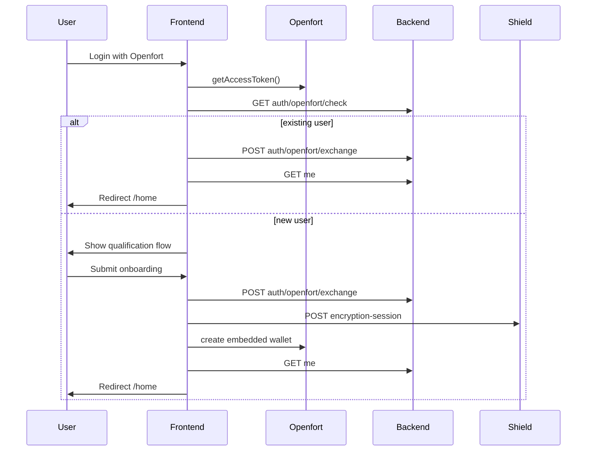

<!-- cspell:words reCAPTCHA -->

# v0.2.3 Openfort Initial Test Plan

## Goal

Bring the `front-pro` frontend up locally against the completed Openfort backend, validate the Openfort auth/session flow, and identify any remaining blockers for end-to-end usage.

## Current integration status

The frontend wiring is already in place:

- `src/lib/openfort-config.tsx`
- `src/components/auth/auth-session-provider.tsx`
- `src/lib/backend-auth-client.ts`
- `src/app/api/auth/encryption-session/route.ts`

The main missing piece for local bring-up is runtime configuration.

## Current local QA status

### Completed

- Local frontend configured with:
  - `NEXT_PUBLIC_OPENFORT_PUBLIC_KEY`
  - `NEXT_PUBLIC_SHIELD_API_KEY`
  - `SHIELD_SECRET_KEY`
  - `SHIELD_ENCRYPTION_SHARE`
  - `NEXT_PUBLIC_API_BASE_URL=http://localhost:8080/v1`
- Local backend running on `http://localhost:8080`
- Openfort Email OTP login worked in local QA
- Backend `GET /v1/auth/openfort/check` returned `200`
- New-user onboarding path completed successfully:
  - Openfort auth
  - qualification questionnaire
  - backend exchange
  - wallet creation
  - redirect to `/home`

### Frontend fixes confirmed during local QA

- Close the Openfort modal before showing the InfraFund questionnaire for new users
- Close the Openfort modal when finalizing authenticated sessions
- Deduplicate repeated frontend bootstrap attempts that were spamming `GET /auth/openfort/check`
- Hide the landing card/Openfort button while onboarding is active
- Raise modal stacking and restore pointer events so questionnaire buttons remain clickable

### Still to verify

- Existing InfraFund user path skips onboarding and goes straight to `/home`
- Non-resident/disqualified flow end-to-end with reCAPTCHA enabled
- Session restore/logout full pass after a successful local exchange cycle

## Required frontend env vars

| Variable | Required | Purpose | Source |
|---|---|---|---|
| `NEXT_PUBLIC_OPENFORT_PUBLIC_KEY` | Yes | Openfort project publishable key used by the frontend auth SDK | Openfort dashboard / existing backend config |
| `NEXT_PUBLIC_SHIELD_API_KEY` | Yes | Shield publishable key used by the embedded wallet client config | Openfort Shield setup |
| `SHIELD_SECRET_KEY` | Yes | Server-side secret used by `src/app/api/auth/encryption-session/route.ts` | Openfort Shield setup |
| `SHIELD_ENCRYPTION_SHARE` | Yes | Server-side encryption share sent to Shield when creating an encryption session | Openfort Shield setup |
| `NEXT_PUBLIC_API_BASE_URL` | Yes | Backend API base URL. For local testing use the local backend base URL | Local backend runtime |
| `NEXT_PUBLIC_WALLET_CONNECT_PROJECT_ID` | No | Enables external wallet support | WalletConnect dashboard |
| `NEXT_PUBLIC_POLICY_ID` | No | Gas sponsorship policy id for transactions | Openfort dashboard |
| `NEXT_PUBLIC_RECAPTCHA_SITE_KEY` | Needed for non-resident flow | Enables waitlist captcha submission | Existing Google reCAPTCHA config |

## SHIELD env vars

### `NEXT_PUBLIC_SHIELD_API_KEY`

- The Shield publishable key.
- Safe for the frontend.
- Used in `src/lib/openfort-config.tsx` as `shieldPublishableKey`.

### `SHIELD_SECRET_KEY`

- The Shield secret key.
- Server-side only.
- Used in `src/app/api/auth/encryption-session/route.ts` as the `x-api-secret` header.

### `SHIELD_ENCRYPTION_SHARE`

- The server-side encryption share used for automatic embedded wallet recovery.
- Server-side only.
- Sent to Shield in the `/project/encryption-session` request body.

### Where to get them

Run the Openfort embedded wallet setup for the project owner account:

```bash
openfort login
openfort embedded-wallet setup
```

Then copy the values from the setup output and/or `~/.config/openfort/credentials` into `.env.local`.

If you prefer the dashboard route, get the Shield publishable/secret credentials from the Openfort project's embedded wallet / Shield configuration in the Openfort dashboard, and use the encryption share generated during embedded-wallet setup.

## Expected local backend targets

The frontend will call:

- `GET /auth/openfort/check`
- `POST /auth/openfort/exchange`
- `POST /auth/refresh`
- `POST /auth/logout`
- `GET /me`
- `GET /locations/countries`
- `POST /non-resident-waitlist/individual`
- `POST /non-resident-waitlist/company`

Because the client uses `credentials: 'include'`, backend CORS and cookies must allow the frontend origin.

## Bring-up sequence

1. Populate `.env.local` from `.env.example`.
2. Set `NEXT_PUBLIC_API_BASE_URL` to the local backend URL.
3. Confirm backend CORS/cookie settings allow the frontend origin.
4. Start the frontend with `npm run dev`.
5. Open `/` and confirm the login screen renders.
6. Validate the Openfort login modal and embedded wallet setup flow.

## Auth flow



## Manual test plan

### 1. Config smoke test

- `NEXT_PUBLIC_OPENFORT_PUBLIC_KEY` and `NEXT_PUBLIC_SHIELD_API_KEY` are set.
- `/` renders the login card.
- The app does not show "Openfort is not configured."

### 2. Existing user flow

Test both:

- Google login
- Email OTP login

Expected:

- auth succeeds
- backend session exchange succeeds
- `/home` loads
- refresh restores session
- protected routes stay accessible

Current status:

- Not yet verified end-to-end in local QA
- Backend logs confirm the `check` endpoint is reachable; need one known-existing `openfort_user_id` in the local backend DB to validate the skip-onboarding path

### 3. New user onboarding flow

Expected:

- qualification modal opens
- role selection works
- individual vs organization branch works
- organization name validation works
- backend exchange succeeds
- embedded wallet creation succeeds
- header shows identity and Wallet button

Current status:

- Verified locally with Email OTP
- Completed path: questionnaire -> wallet setup -> redirect to `/home`

### 4. Non-resident / disqualified flow

Expected:

- non-resident form opens
- countries load from backend
- submission works when reCAPTCHA is configured
- user is signed out after completion

Current status:

- Not yet exercised end-to-end
- `NEXT_PUBLIC_RECAPTCHA_SITE_KEY` is still required to fully validate submission

### 5. Failure-path checks

Verify UI behavior for:

- missing Shield vars
- missing backend base URL
- backend unavailable
- CORS/cookie misconfiguration
- Shield encryption-session failure
- wallet creation failure

## Known current blockers

- `NEXT_PUBLIC_RECAPTCHA_SITE_KEY` is still missing for full non-resident/waitlist QA
- Existing-user skip-onboarding flow still needs a verified known-existing user in the local backend dataset

## Execution plan after this document is added

1. Verify existing-user path with a known `openfort_user_id` already present in the local backend database
2. Test Google login in addition to Email OTP
3. Test non-resident path once reCAPTCHA is configured
4. Verify refresh/session restore after successful exchange
5. Verify logout clears the backend refresh session and blocks protected routes
