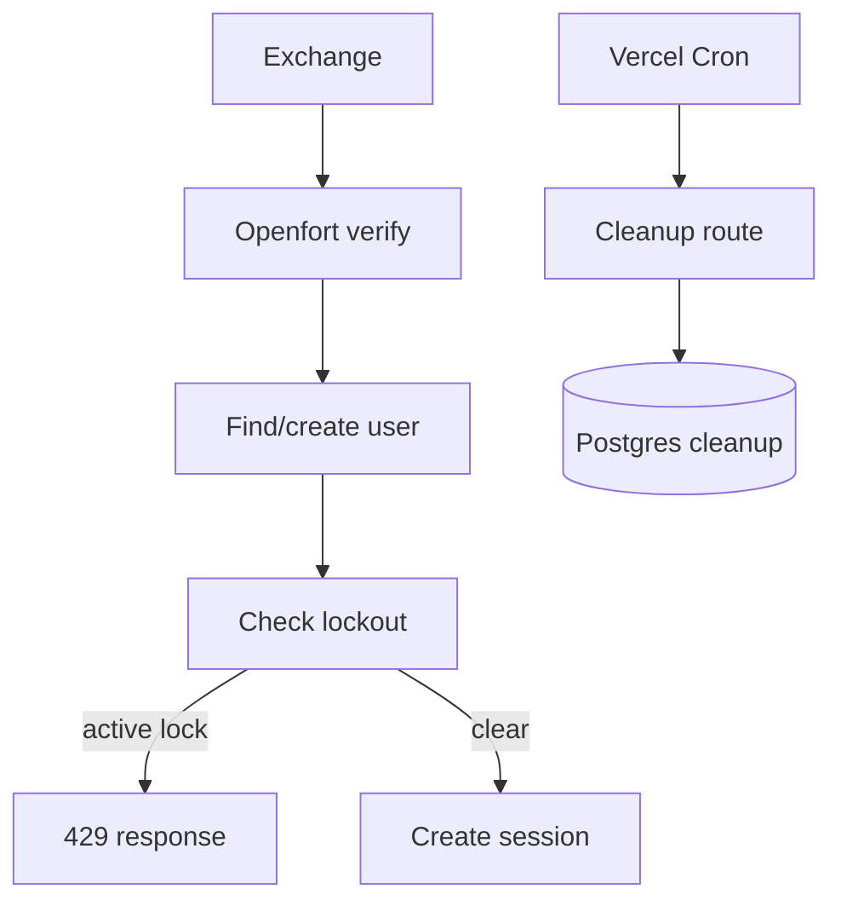

# v1.0.7 Backend Next Migration

## Summary

Phase 7 adds the lockout and cleanup behavior that still makes sense for the Next.js-only backend while intentionally dropping Go-backend-only scheduling and credential-attempt tracking.

## Implemented

- Added a lightweight account lockout guard for existing `account_lockouts` rows.
- Blocked `/api/v1/auth/openfort/exchange` for existing users when `locked_until` is still in the future.
- Reset stale, expired, or otherwise non-active lockout state after successful Openfort verification.
- Added a protected `GET /api/cron/cleanup` route for serverless cleanup jobs.
- Added cleanup for:
  - expired `account_lockouts`
  - `lockout_audit_logs` older than 90 days
  - `sessions` expired or revoked more than 90 days ago
- Protected cleanup with `Authorization: Bearer $CRON_SECRET`.
- Added `CRON_SECRET` to server-only environment validation.
- Added `TOO_MANY_REQUESTS` API error handling for locked accounts.

## Intentionally Dropped

- The Go backend goroutine/ticker scheduler was not ported. Vercel cron or another deployment cron should call the protected Next.js route instead.
- Local failed-attempt tracking and artificial auth delays were not ported. Openfort owns credential authentication now, and the Next.js app only verifies Openfort tokens before creating InfraFund app sessions.
- Go DI/service boilerplate was not copied.

## Validation

- `npm run format`
- `npx tsc --noEmit`
- `npm run build`
