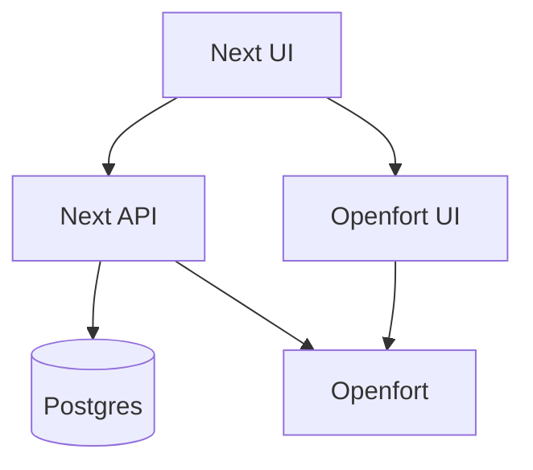
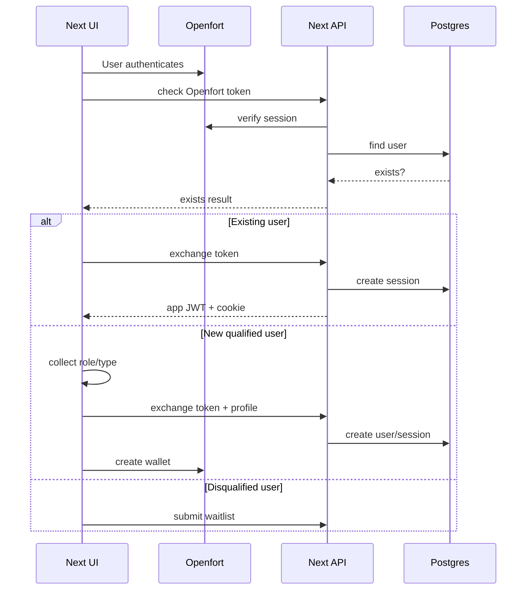

<!-- cspell:words Openfort Infrafund InfraFund backpro frontpro waitlists nonresident waitlist AppRouter Prisma sqlc Huma Fiber zerolog pino nodemailer jose httpOnly Vercel Railway Supabase EVM KYC KYB GDPR UUIDv uuidv reCAPTCHA CAPTCHA OFUI koanf signups Sumsub -->

# Task 100: Next.js Backend Migration Plan

**Status:** Pending
**Target repo:** `front-pro`
**Backend to retire:** `../backpro`
**Decision:** Migrate backend functionality into the existing Next.js app first, then simplify Openfort. Do not rebase the app onto the Openfort sample project.

## 1. Goal

Make `front-pro` a single self-sufficient Next.js application by replacing the Go backend in `../backpro` with Next.js App Router API routes and server-only support code.

The migration must be resumable. Each phase below is intended to be small enough to implement, validate, document status, and commit independently.

## 2. Source-of-truth references

- Existing migration research: `../backpro/docs-dev/tasks/task-100-nextjs-migration.md`
- Openfort backend/onboarding plans:
  - `../backpro/docs-dev/tasks/v0.2.2-openfort-implementation-with-onboarding-backend.md`
  - `../backpro/docs-dev/tasks/v0.2.5-openfort-backend-implementation-review.md`
  - `../backpro/docs-dev/tasks/v0.2.6-tests-auth-HTTP-routes.md`
  - `../backpro/docs-dev/tasks/v0.2.7-openfort-account-deletion.md`
- Openfort docs:
  - `https://www.openfort.io/docs/overview/building-with-ai`
  - `https://www.openfort.io/docs/products/embedded-wallet/react`
  - `https://www.openfort.io/docs/configuration/custom-auth/auth-token`
- Openfort sample app:
  - `https://github.com/openfort-xyz/openfort-js/tree/main/examples/apps/auth-sample`

## 3. Architecture decision

Choose option **A**:

1. Keep this Next.js app as the base.
2. Move the Go backend contracts into Next.js API routes.
3. Retain PostgreSQL and existing data model.
4. Keep Openfort responsible for auth and wallet lifecycle.
5. Keep Next.js responsible for InfraFund app sessions, profile, authorization, and CRUD endpoints.
6. Use the Openfort sample app only as a reference for minimal provider setup and wallet calls.

Do **not** choose option B unless this plan fails for a concrete reason. The sample app is a demo/template, uses Pages Router, brings unrelated UI and dependencies, and would force unnecessary migration of the existing frontend into a different structure.



## 4. Target runtime boundaries

| Area | Owner after migration | Notes |
| --- | --- | --- |
| Public landing pages | Next.js UI | Existing app remains the base. |
| Public form endpoints | Next.js API | Replace proxying to Go backend. |
| Database | PostgreSQL | Keep existing data; no migration unless schema mismatch requires it. |
| DB access | Prisma or equivalent server-only TS layer | Prefer Prisma per original research unless a lighter layer is selected before Phase 2. |
| App auth/session | Next.js API | JWT access token and httpOnly refresh cookie. |
| Openfort auth/wallet | Openfort SDK/API | Verify Openfort session server-side, defer wallet creation until qualification. |
| Background cleanup | Cron-compatible Next.js route or deployment cron | Delete expired sessions/lockouts/audit logs. |
| Email | Node mailer service | Replace Go SMTP implementation. |

## 5. Endpoint parity matrix

Status values: `pending`, `in-progress`, `done`, `deferred`.

| Go endpoint | Target Next.js route | Auth | Tables/services | Status |
| --- | --- | --- | --- | --- |
| `GET /v1/auth/openfort/check` | `GET /api/v1/auth/openfort/check` | Openfort token | `users`, Openfort session lookup | pending |
| `POST /v1/auth/openfort/exchange` | `POST /api/v1/auth/openfort/exchange` | Openfort token | `users`, `sessions`, `wallets`, lockout service | pending |
| `POST /v1/auth/refresh` | `POST /api/v1/auth/refresh` | refresh cookie | `sessions` | pending |
| `POST /v1/auth/logout` | `POST /api/v1/auth/logout` | app session | `sessions` | pending |
| `GET /v1/me` | `GET /api/v1/me` | app session | `users`, `wallets` | pending |
| `DELETE /v1/me` | `DELETE /api/v1/me` | app session | `users`, Openfort account deletion if needed | pending |
| `GET /v1/account/status` | `GET /api/v1/account/status` | app session | `users` | pending |
| `GET /v1/kyc/status` | `GET /api/v1/kyc/status` | app session | `users` | pending |
| `POST /v1/waitlists` | `POST /api/v1/waitlists` | captcha | `waitlist` | pending |
| `POST /v1/contact-forms` | `POST /api/v1/contact-forms` | captcha | `contact_forms`, email service | pending |
| `POST /v1/non-resident-waitlist/individual` | `POST /api/v1/non-resident-waitlist/individual` | captcha | `non_resident_waitlists`, `countries` | pending |
| `POST /v1/non-resident-waitlist/company` | `POST /api/v1/non-resident-waitlist/company` | captcha | `non_resident_waitlists`, `countries` | pending |
| `GET /v1/locations/countries` | `GET /api/v1/locations/countries` | optional | `countries` | pending |

## 6. Target auth flow



## 7. Commit-sized phases

Before starting any phase:

1. Read this file and update the phase status.
2. Run `git status` and inspect existing changes.
3. Avoid mixing unrelated edits into the phase commit.
4. After changes, run the validators listed for the phase.
5. Update the phase status and resume notes before committing.

### Phase 0: Inventory and baseline

**Status:** pending
**Goal:** Confirm frontend and backend contracts before any migration code.

Tasks:

- [ ] Capture current `front-pro` API routes and backend-auth behavior.
- [ ] Capture current `../backpro` routes, database migrations, env vars, and tests.
- [ ] Confirm whether existing PostgreSQL database should be reused directly.
- [ ] Confirm deployment target: Vercel, Railway, or another Node-compatible host.
- [ ] Confirm required runtime env names.

Expected files changed:

- This plan file only, if recording status.

Validation:

- `npm run format:prettier -- docs-dev/tasks/task-100-nextjs-migration-plan.md` if the command supports file args.
- Otherwise: `npx prettier --check docs-dev/tasks/task-100-nextjs-migration-plan.md`.

Commit boundary:

- Suggested commit: `docs: add nextjs backend migration plan`

Resume notes:

- If interrupted here, continue by opening this file and the existing `../backpro/docs-dev/tasks/task-100-nextjs-migration.md`.

### Phase 1: Next.js backend foundation

**Status:** pending
**Goal:** Add shared server-only primitives without porting endpoint logic yet.

Tasks:

- [ ] Create server-only env validation.
- [ ] Add shared API error shape and response helpers.
- [ ] Add request metadata helper for IP, user agent, platform, browser, and device.
- [ ] Add captcha verification helper or preserve existing helper if already sufficient.
- [ ] Add structured server logger.

Expected files changed:

- `src/server/env.ts`
- `src/server/http/*`
- `src/server/logger.ts`
- Existing API routes only if needed to adopt shared helpers.

Validation:

- `npm run format:prettier`
- `npm run format:lint`
- `npx tsc --noEmit`

Commit boundary:

- Suggested commit: `feat(api): add nextjs backend foundation`

Resume notes:

- This phase should not change endpoint behavior.
- If validators fail due pre-existing issues, record exact failures in this section before stopping.

### Phase 2: Database schema and access layer

**Status:** pending
**Goal:** Make Next.js able to read/write the existing PostgreSQL schema.

Tasks:

- [ ] Choose DB layer. Default: Prisma.
- [ ] Generate or write schema for existing tables:
  - `users`
  - `user_organizations`
  - `wallets`
  - `sessions`
  - `account_lockouts`
  - `lockout_audit_logs`
  - `waitlist`
  - `contact_forms`
  - `countries`
  - `non_resident_waitlists`
- [ ] Ensure UUID, enum, timestamp, soft-delete, and composite-key behavior matches Go backend.
- [ ] Add database client singleton safe for Next.js dev reloads.
- [ ] Add seed/introspection notes if direct reuse of DB requires manual setup.

Expected files changed:

- `prisma/schema.prisma` or selected DB-layer equivalent.
- `src/server/db/*`
- Package files if dependencies are added.

Validation:

- DB schema generation command, for example `npx prisma generate`.
- `npm run format:prettier`
- `npm run format:lint`
- `npx tsc --noEmit`

Commit boundary:

- Suggested commit: `feat(db): add postgres access layer`

Resume notes:

- Do not proceed to endpoint ports until DB access can connect locally or a clear mock strategy is recorded.

### Phase 3: Public CRUD endpoints

**Status:** pending
**Goal:** Replace simple Go public endpoints first.

Tasks:

- [ ] Implement `POST /api/v1/waitlists`.
- [ ] Implement `POST /api/v1/contact-forms`.
- [ ] Implement `POST /api/v1/non-resident-waitlist/individual`.
- [ ] Implement `POST /api/v1/non-resident-waitlist/company`.
- [ ] Implement `GET /api/v1/locations/countries`.
- [ ] Preserve duplicate checks, country FK validation, captcha handling, and response status codes.
- [ ] Update existing frontend route proxies only if needed for same-origin compatibility.

Expected files changed:

- `src/app/api/v1/waitlists/route.ts`
- `src/app/api/v1/contact-forms/route.ts`
- `src/app/api/v1/non-resident-waitlist/individual/route.ts`
- `src/app/api/v1/non-resident-waitlist/company/route.ts`
- `src/app/api/v1/locations/countries/route.ts`
- `src/server/repositories/*`
- `src/server/services/*`
- Tests for route handlers/services.

Validation:

- Relevant route/service tests.
- `npm run format:prettier`
- `npm run format:lint`
- `npx tsc --noEmit`

Commit boundary:

- Suggested commit: `feat(api): port public backend endpoints`

Resume notes:

- These endpoints are independent of Openfort and should be completed before auth migration.

### Phase 4: Openfort check and exchange

**Status:** pending
**Goal:** Port the onboarding-aware auth split from Go.

Tasks:

- [ ] Add server-side Openfort session verification.
- [ ] Implement `GET /api/v1/auth/openfort/check`.
- [ ] Implement `POST /api/v1/auth/openfort/exchange`.
- [ ] Preserve existing behavior:
  - existing user can exchange token without onboarding fields.
  - new user must provide role and type.
  - organization user requires organization name.
  - role aliases `client` and `dao` are accepted only if still required by frontend compatibility.
  - invalid Openfort token returns `401`.
- [ ] Create server-side session row on successful exchange.
- [ ] Return app access token and set refresh cookie.

Expected files changed:

- `src/app/api/v1/auth/openfort/check/route.ts`
- `src/app/api/v1/auth/openfort/exchange/route.ts`
- `src/server/openfort/*`
- `src/server/auth/*`
- `src/server/repositories/users.ts`
- `src/server/repositories/sessions.ts`
- Tests.

Validation:

- Auth service and route tests.
- `npm run format:prettier`
- `npm run format:lint`
- `npx tsc --noEmit`

Commit boundary:

- Suggested commit: `feat(auth): port openfort check exchange`

Resume notes:

- Use `../backpro/docs-dev/tasks/v0.2.5-openfort-backend-implementation-review.md` as the expected behavior checklist.

### Phase 5: JWT, refresh, logout, and middleware

**Status:** pending
**Goal:** Replace Go session management completely.

Tasks:

- [ ] Add JWT signing and verification using a server-only secret.
- [ ] Add opaque refresh token generation and SHA-256 hashing.
- [ ] Implement `POST /api/v1/auth/refresh`.
- [ ] Implement `POST /api/v1/auth/logout`.
- [ ] Add middleware or route helper for protected endpoints.
- [ ] Preserve session expiry behavior:
  - idle/activity timeout.
  - absolute expiration.
  - revocation fields.
- [ ] Ensure cookies are `httpOnly`, `secure` in production, `sameSite`, and path-scoped.

Expected files changed:

- `src/server/auth/jwt.ts`
- `src/server/auth/tokens.ts`
- `src/server/auth/session.ts`
- `src/app/api/v1/auth/refresh/route.ts`
- `src/app/api/v1/auth/logout/route.ts`
- `src/middleware.ts` or route-level auth helpers.
- Tests.

Validation:

- Auth/session tests.
- `npm run format:prettier`
- `npm run format:lint`
- `npx tsc --noEmit`

Commit boundary:

- Suggested commit: `feat(auth): add nextjs session lifecycle`

Resume notes:

- Do not switch frontend auth consumers until refresh/logout behavior is tested.

### Phase 6: Protected profile and status endpoints

**Status:** pending
**Goal:** Port user-facing protected API contracts.

Tasks:

- [ ] Implement `GET /api/v1/me`.
- [ ] Implement `DELETE /api/v1/me`.
- [ ] Implement `GET /api/v1/account/status`.
- [ ] Implement `GET /api/v1/kyc/status`.
- [ ] Preserve soft-delete/GDPR behavior.
- [ ] Confirm whether Openfort account deletion is required in this phase or deferred.

Expected files changed:

- `src/app/api/v1/me/route.ts`
- `src/app/api/v1/account/status/route.ts`
- `src/app/api/v1/kyc/status/route.ts`
- `src/server/services/account.ts`
- Tests.

Validation:

- Protected route tests.
- `npm run format:prettier`
- `npm run format:lint`
- `npx tsc --noEmit`

Commit boundary:

- Suggested commit: `feat(api): port protected account endpoints`

Resume notes:

- Compare against Go responses before frontend switch.

### Phase 7: Lockout, audit, and cleanup jobs

**Status:** pending
**Goal:** Preserve security and cleanup behavior from Go backend.

Tasks:

- [ ] Port account lockout service.
- [ ] Port lockout audit logging.
- [ ] Add cleanup route/job for expired lockouts.
- [ ] Add cleanup route/job for audit logs older than 90 days.
- [ ] Add cleanup route/job for expired sessions older than 90 days.
- [ ] Protect cleanup route with a cron secret if exposed as an HTTP route.

Expected files changed:

- `src/server/auth/lockout.ts`
- `src/server/repositories/lockouts.ts`
- `src/app/api/cron/cleanup/route.ts`
- Tests.

Validation:

- Lockout service tests.
- Cron route tests if practical.
- `npm run format:prettier`
- `npm run format:lint`
- `npx tsc --noEmit`

Commit boundary:

- Suggested commit: `feat(auth): add lockout and cleanup jobs`

Resume notes:

- This phase can be deferred only if the deployment is not yet public.

### Phase 8: Frontend same-origin API switch

**Status:** pending
**Goal:** Stop frontend code from depending on the Go backend base URL.

Tasks:

- [ ] Replace proxy-style routes that call `getServerUrl(...)` with direct Next.js implementations or compatibility redirects.
- [ ] Update frontend API service paths to use same-origin `/api/v1/...` routes.
- [ ] Remove or deprecate `API_URL`/`NEXT_PUBLIC_API_BASE_URL` where no longer needed.
- [ ] Keep old route aliases temporarily if UI code still calls them:
  - `/api/waitlists`
  - `/api/contact`
  - `/api/locations`
  - `/api/non-resident/*`

Expected files changed:

- `src/services/apiService.ts`
- `src/utils/get-server-url.util.ts` if still needed.
- Existing `src/app/api/*` compatibility routes.
- UI components that call backend endpoints.

Validation:

- UI smoke tests for forms.
- `npm run format:prettier`
- `npm run format:lint`
- `npx tsc --noEmit`

Commit boundary:

- Suggested commit: `feat(api): switch frontend to next routes`

Resume notes:

- Keep compatibility aliases until all UI call sites are verified.

### Phase 9: Openfort simplification

**Status:** pending
**Goal:** Keep Openfort integration minimal and aligned with the onboarding flow.

Tasks:

- [ ] Add minimal Openfort provider setup for Next.js App Router.
- [ ] Use `connectOnLogin: false` so auth does not create a wallet before qualification.
- [ ] Use a single Openfort entry point in the public UI.
- [ ] After successful qualification and app-session exchange, create the wallet.
- [ ] Avoid importing the full sample app UI, Pages Router structure, and unrelated dependencies.
- [ ] Treat Openfort CLI as optional admin/MCP tooling, not a runtime requirement.

Expected files changed:

- `src/app/layout.tsx` or app provider wrapper.
- `src/lib/openfort-config.tsx` or equivalent.
- Login/onboarding components.
- Package files if SDK dependencies are added.

Validation:

- Manual Openfort auth smoke test.
- New or existing frontend tests if available.
- `npm run format:prettier`
- `npm run format:lint`
- `npx tsc --noEmit`

Commit boundary:

- Suggested commit: `feat(auth): simplify openfort app integration`

Resume notes:

- If Openfort SDK behavior is unclear, read `https://www.openfort.io/docs/products/embedded-wallet/react` and inspect the auth sample for only the provider/config pattern.

### Phase 10: Final parity and Go backend retirement

**Status:** pending
**Goal:** Confirm Next.js is production-ready without `../backpro`.

Tasks:

- [ ] Run endpoint parity tests against Next.js.
- [ ] Run auth flow tests:
  - existing user check.
  - existing user exchange.
  - new qualified individual.
  - new qualified organization.
  - missing onboarding fields.
  - invalid Openfort token.
  - refresh.
  - logout.
- [ ] Run public form tests.
- [ ] Run protected profile/status tests.
- [ ] Remove stale Go backend env vars from frontend deployment.
- [ ] Confirm deployment target supports DB, cron, and required secrets.
- [ ] Archive or retire `../backpro` only after production verification.

Expected files changed:

- Deployment config if needed.
- Env docs/config examples only if explicitly requested.
- This plan file status updates.

Validation:

- `npm run format:prettier`
- `npm run format:lint`
- `npx tsc --noEmit`
- Any added test suite.
- Production-like smoke test.

Commit boundary:

- Suggested commit: `chore: complete nextjs backend migration`

Resume notes:

- Do not delete or disable `../backpro` until production smoke tests pass.

## 8. Dependency policy

Before adding any dependency:

1. Check whether it is already installed.
2. Prefer built-in Next.js/Node APIs when sufficient.
3. Keep server-only packages out of client bundles.
4. Expected likely additions:
   - DB layer: `prisma`, `@prisma/client` or selected alternative.
   - JWT: `jose`.
   - Email: `nodemailer`.
   - Logging: `pino`.
   - Openfort client/server SDK packages only where needed.

## 9. Security checklist

- [ ] No Openfort secret key in client code.
- [ ] No JWT secret in client code.
- [ ] No refresh token stored in localStorage/sessionStorage.
- [ ] Refresh cookie is `httpOnly`.
- [ ] Production cookies are `secure`.
- [ ] Captcha token is validated server-side.
- [ ] Cleanup/cron routes require a secret.
- [ ] Logs do not include tokens, secrets, full captcha values, or PII beyond what is necessary.
- [ ] Account deletion preserves GDPR requirements.
- [ ] DB queries enforce soft-delete rules where required.

## 10. Validation policy

After any code change, run the fastest relevant validator before continuing. Before committing a phase, run all validators relevant to that phase.

Default validators for code phases:

```sh
npm run format:prettier
npm run format:lint
npx tsc --noEmit
```

Do not run `npm run build` for every small iteration. Run it before production deployment, before final migration completion, or when changes touch Next.js runtime/build configuration.

## 11. How to resume after an interruption

1. Run `git status`.
2. Open this file.
3. Find the first phase whose status is not `done`.
4. Read that phase's resume notes.
5. Inspect files listed in that phase's "Expected files changed" section.
6. Run the phase validators before continuing if the working tree already contains changes.
7. Continue only within the current phase unless explicitly deciding to change phases.

## 12. Current progress log

| Date | Phase | Status | Notes |
| --- | --- | --- | --- |
| 2026-04-28 | Planning | done | Decided to migrate `front-pro` in place and avoid adopting the Openfort sample app as the base. |

## 13. Preserved research from `../backpro`

The original research file is still useful as historical context, but the unique implementation details worth preserving are summarized here so this plan can stand alone in `front-pro`.

### Current Go backend snapshot

| Area | Current `backpro` implementation | Next.js migration note |
| --- | --- | --- |
| HTTP | Go Fiber + Huma OpenAPI | Replace with App Router route handlers. |
| Architecture | Clean Architecture / DDD with domain, application, infrastructure, interface layers | Keep explicit server-only services/repositories where useful; avoid over-porting DI structure. |
| DB | PostgreSQL via `pgx` and `sqlc` | Keep PostgreSQL; use Prisma or selected TS DB layer. |
| Auth | JWT HS256 plus opaque refresh-token hashes | Use `jose` plus Node `crypto`. |
| Email | SMTP notification service | Use `nodemailer` or equivalent server-only mailer. |
| Logging | `zerolog` | Use `pino` or existing app logging standard. |
| DI/config | `uber/fx`, `koanf`, dotenv | Replace with module imports and typed env validation. |

### Database tables to preserve

| Table | Important behavior |
| --- | --- |
| `users` | UUIDv7 ID, `openfort_user_id`, email/name/phone, KYC/KYB flags, individual/company type, role, status, GDPR and soft-delete fields. |
| `user_organizations` | Organization metadata for company users. |
| `wallets` | Composite identity by user, chain, and public address. |
| `sessions` | Refresh token hash, user agent, IP, platform/browser/device, idle expiry, absolute expiry, and revocation metadata. |
| `account_lockouts` | Brute-force protection state. |
| `lockout_audit_logs` | Security audit history. |
| `waitlist` | Email waitlist signups and duplicate prevention. |
| `contact_forms` | Contact/support form lifecycle plus IP/user-agent metadata. |
| `countries` | Pre-seeded country reference data with ISO and phone-code fields. |
| `non_resident_waitlists` | Individual/company prospect submissions tied to country. |

### External integrations to preserve or simplify

| Integration | Current behavior | Migration note |
| --- | --- | --- |
| Openfort session lookup | `GET /iam/v2/auth/get-session` verifies access token and returns user profile data. | Keep as server-side verification for check/exchange. |
| Openfort user deletion | `DELETE /v2/users/{id}` during account deletion. | Port in protected account deletion phase; decide retry/circuit-breaker depth then. |
| reCAPTCHA/captcha | Supports Google reCAPTCHA, hCaptcha, and Cloudflare Turnstile through Go library. | Preserve accepted provider(s) actually used by deployed frontend. |
| SMTP | Contact form sends async HTML email to team address. | Port as fire-and-forget server-side email with safe logging. |
| Sumsub | Placeholder only; not implemented. | Do not add during migration unless a separate task requires it. |

### Complexity and effort assumptions

- Public CRUD endpoints are low-risk and should be ported before auth.
- `POST /api/v1/auth/openfort/exchange` is the highest-risk endpoint because it orchestrates Openfort verification, user provisioning, lockout checks, session creation, JWT minting, and refresh-cookie issuance.
- Session refresh is medium risk because it must preserve idle timeout, absolute timeout, and revocation checks.
- Account deletion is medium risk because it combines local soft-delete, session revocation, and Openfort user deletion.
- The meaningful backend port is mostly business logic; Go framework, DI, and repository boilerplate should not be copied literally.

### Migration component mapping

| Go component | Next.js replacement |
| --- | --- |
| Fiber/Huma handlers | `src/app/api/**/route.ts` |
| sqlc repositories | Prisma or selected TS repository layer |
| Go JWT package | `jose` |
| Opaque token package | Node `crypto` random bytes + SHA-256 |
| SMTP package | `nodemailer` |
| Custom errors | Shared TS API error helpers |
| Auth middleware | Route-level auth helper and/or `src/middleware.ts` |
| Background goroutine | Deployment cron or protected cleanup route |
