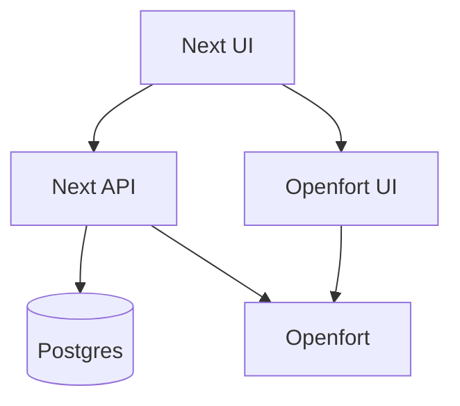
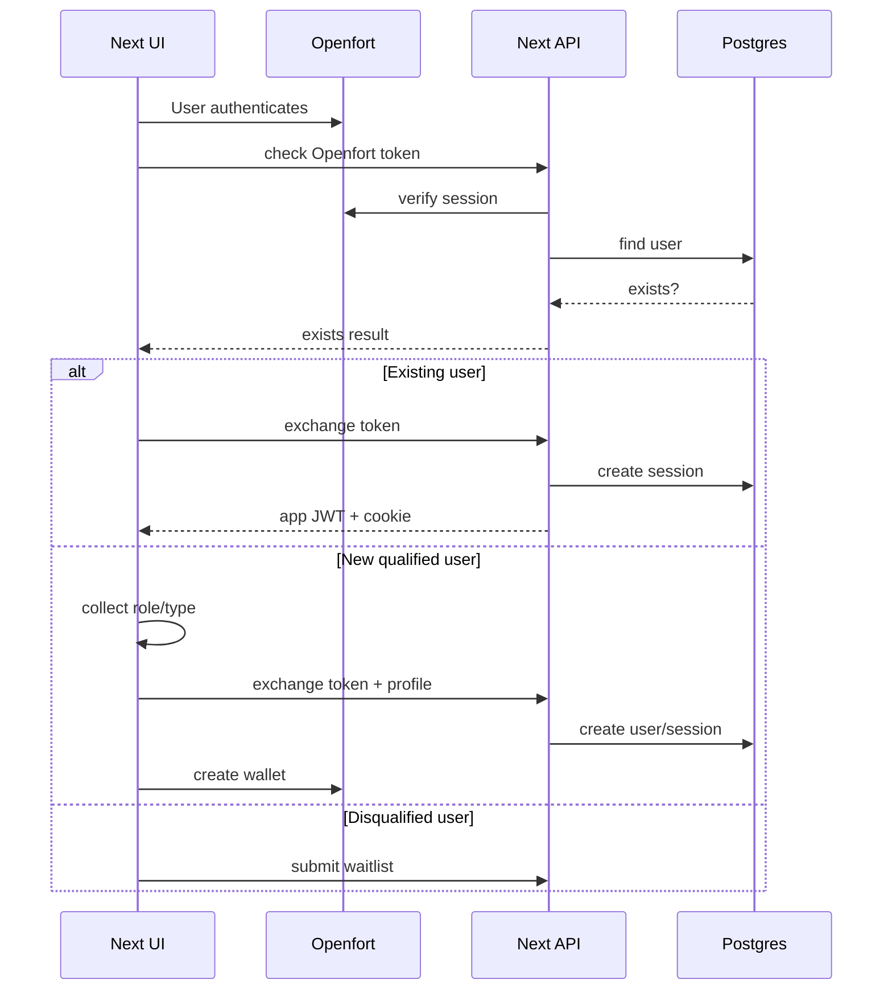

<!-- cspell:words Openfort Infrafund InfraFund backpro frontpro waitlists nonresident waitlist AppRouter Prisma sqlc Huma Fiber zerolog pino nodemailer jose httpOnly Vercel Railway Supabase EVM KYC KYB GDPR UUIDv uuidv reCAPTCHA CAPTCHA OFUI koanf signups Sumsub -->

# Task 100: Next.js Backend Migration Plan

**Status:** In progress
**Target repo:** `front-pro`
**Backend to retire:** `../backpro`
**Decision:** Fully retire the Go backend and build the fresh backend implementation in the existing Next.js app. Do not rebase the app onto the Openfort sample project.

## 1. Goal

Make `front-pro` a single self-sufficient Next.js application by replacing the Go backend in `../backpro` with Next.js App Router API routes and server-only support code.

The migration must be resumable. Each phase below is intended to be small enough to implement, validate, document status, and commit independently.

## 2. Source-of-truth references

- Existing migration research: `../backpro/docs-dev/tasks/task-100-nextjs-migration.md`
  - Treat Go/backend material as historical parity reference only. Do not copy Go architecture or use it as primary implementation guidance.
- Openfort backend/onboarding plans:
  - `../backpro/docs-dev/tasks/v0.2.2-openfort-implementation-with-onboarding-backend.md`
  - `../backpro/docs-dev/tasks/v0.2.5-openfort-backend-implementation-review.md`
  - `../backpro/docs-dev/tasks/v0.2.6-tests-auth-HTTP-routes.md`
  - `../backpro/docs-dev/tasks/v0.2.7-openfort-account-deletion.md`
- Openfort docs:
  - `https://www.openfort.io/docs/overview/building-with-ai`
  - `https://www.openfort.io/docs/products/embedded-wallet/react`
  - `https://www.openfort.io/docs/configuration/custom-auth/auth-token`
  - For Openfort-related tasks, use the project Openfort `SKILL.md` and current Openfort documentation first.
- Openfort sample app:
  - `https://github.com/openfort-xyz/openfort-js/tree/main/examples/apps/auth-sample`

## 3. Architecture decision

Choose option **A**:

1. Keep this Next.js app as the base.
2. Recreate required backend contracts directly in Next.js API routes.
3. Start with the existing PostgreSQL database and data model; consider a later move to Vercel database after migration completion.
4. Keep Openfort responsible for auth and wallet lifecycle.
5. Keep Next.js responsible for InfraFund app sessions, profile, authorization, and CRUD endpoints.
6. Use the Openfort sample app only as optional guidance for minimal provider setup and wallet calls.

Do **not** choose option B unless this plan fails for a concrete reason. The sample app is a demo/template, uses Pages Router, brings unrelated UI and dependencies, and would force unnecessary migration of the existing frontend into a different structure.



## 4. Target runtime boundaries

| Area | Owner after migration | Notes |
| --- | --- | --- |
| Public landing pages | Next.js UI | Existing app remains the base. |
| Public form endpoints | Next.js API | Implement directly in Next.js; do not proxy to Go. |
| Database | PostgreSQL | Start with existing PostgreSQL data; revisit Vercel database after migration completion. |
| DB access | Prisma or equivalent server-only TS layer | Prefer Prisma per original research unless a lighter layer is selected before Phase 2. |
| App auth/session | Next.js API | JWT access token and httpOnly refresh cookie. |
| Openfort auth/wallet | Openfort SDK/API | Verify Openfort session server-side, defer wallet creation until qualification. |
| Background cleanup | Cron-compatible Next.js route or deployment cron | Delete expired sessions/lockouts/audit logs. |
| Email | Node mailer service | Replace Go SMTP implementation. |

## 5. Endpoint parity matrix

Status values: `pending`, `in-progress`, `done`, `deferred`.

| Go endpoint | Target Next.js route | Auth | Tables/services | Status |
| --- | --- | --- | --- | --- |
| `GET /v1/auth/openfort/check` | `GET /api/v1/auth/openfort/check` | Openfort token | `users`, Openfort session lookup | done |
| `POST /v1/auth/openfort/exchange` | `POST /api/v1/auth/openfort/exchange` | Openfort token | `users`, `sessions`, `wallets`, lockout service | done |
| `POST /v1/auth/refresh` | `POST /api/v1/auth/refresh` | refresh cookie | `sessions` | done |
| `POST /v1/auth/logout` | `POST /api/v1/auth/logout` | app session | `sessions` | done |
| `GET /v1/me` | `GET /api/v1/me` | app session | `users`, `wallets` | done |
| `DELETE /v1/me` | `DELETE /api/v1/me` | app session | `users`, Openfort user deletion, local soft delete | done |
| `GET /v1/account/status` | `GET /api/v1/account/status` | app session | `users` | done |
| `GET /v1/kyc/status` | `GET /api/v1/kyc/status` | app session | `users` | done |
| `POST /v1/waitlists` | `POST /api/v1/waitlists` | captcha | `waitlist` | done |
| `POST /v1/contact-forms` | `POST /api/v1/contact-forms` | captcha | `contact_forms`, email service | done |
| `POST /v1/non-resident-waitlist/individual` | `POST /api/v1/non-resident-waitlist/individual` | captcha | `non_resident_waitlists`, `countries` | done |
| `POST /v1/non-resident-waitlist/company` | `POST /api/v1/non-resident-waitlist/company` | captcha | `non_resident_waitlists`, `countries` | done |
| `GET /v1/locations/countries` | `GET /api/v1/locations/countries` | optional | `countries` | done |

## 6. Target auth flow



## 7. Commit-sized phases

Before starting any phase:

1. Read this file and update the phase status.
2. Run `git status` and inspect existing changes.
3. Avoid mixing unrelated edits into the phase commit.
4. After changes, run the validators listed for the phase.
5. Update the phase status and resume notes before committing.

### Phase 0: Inventory and baseline

**Status:** done
**Goal:** Confirm the fresh Next.js migration baseline before implementation.

Tasks:

- [x] Capture current `front-pro` API routes and auth behavior.
- [x] Fully retire the Go backend and build a fresh Next.js implementation.
- [x] Use `../backpro` only as historical parity reference where needed.
- [x] Confirm Openfort tasks must use the Openfort `SKILL.md` and current docs first.
- [x] Start with the existing PostgreSQL database; consider Vercel database after migration completion.
- [x] Confirm Vercel as the intended deployment target. Keep other deployment scripts only if they do not interfere with the clean Vercel-first approach.
- [x] Keep the Openfort sample app available as optional implementation guidance:
  `https://github.com/openfort-xyz/openfort-js/tree/main/examples/apps/auth-sample`.
- [x] Confirm required runtime env names.

Expected files changed:

- This plan file only, if recording status.

Validation:

- `npm run format:prettier -- docs-dev/tasks/task-100-nextjs-migration-plan.md` if the command supports file args.
- Otherwise: `npx prettier --check docs-dev/tasks/task-100-nextjs-migration-plan.md`.

Commit boundary:

- Suggested commit: `docs: add nextjs backend migration plan`

Resume notes:

- If interrupted here, continue from this file. Consult `../backpro` only for endpoint parity or data-shape questions, and use Openfort `SKILL.md`/current docs for Openfort decisions.

### Phase 1: Next.js backend foundation

**Status:** done
**Goal:** Add shared server-only primitives without porting endpoint logic yet.

Tasks:

- [x] Create server-only env validation.
- [x] Add shared API error shape and response helpers.
- [x] Add request metadata helper for IP, user agent, platform, browser, and device.
- [x] Add captcha verification helper or preserve existing helper if already sufficient.
- [x] Add structured server logger.

Expected files changed:

- `src/server/env.ts`
- `src/server/http/*`
- `src/server/logger.ts`
- Existing API routes only if needed to adopt shared helpers.

Validation:

- `npm run format:prettier`
- `npm run format:lint`
- `npx tsc --noEmit`

Commit boundary:

- Suggested commit: `feat(api): add nextjs backend foundation`

Resume notes:

- Done in commit `bbe5eb9`.
- Added `src/server/env.ts`, shared `src/server/http/*` helpers, `src/server/logger.ts`, and adopted the shared env/logger/error helpers in the existing Shield encryption-session route.
- Endpoint behavior is otherwise unchanged.

### Phase 2: Database schema and access layer

**Status:** done
**Goal:** Make Next.js able to read/write the existing PostgreSQL schema.

Tasks:

- [x] Choose DB layer. Default: Prisma.
- [x] Generate or write schema for existing tables:
  - `users`
  - `user_organizations`
  - `wallets`
  - `sessions`
  - `account_lockouts`
  - `lockout_audit_logs`
  - `waitlist`
  - `contact_forms`
  - `countries`
  - `non_resident_waitlists`
- [x] Ensure UUID, enum, timestamp, soft-delete, and composite-key behavior matches Go backend.
- [x] Add database client singleton safe for Next.js dev reloads.
- [x] Add seed/introspection notes if direct reuse of DB requires manual setup.

Expected files changed:

- `prisma/schema.prisma` or selected DB-layer equivalent.
- `prisma.config.ts` if using Prisma 7+.
- `src/server/db/*`
- Package files if dependencies are added.

Validation:

- DB schema generation command, for example `npx prisma generate`.
- `npm run format:prettier`
- `npm run format:lint`
- `npx tsc --noEmit`

Commit boundary:

- Suggested commit: `feat(db): add postgres access layer`

Resume notes:

- Done across commits `bbe5eb9` and `46c1afb`.
- DB layer uses Prisma 7 with `@prisma/adapter-pg`, `pg`, `prisma.config.ts`, and a lazy Next.js-safe client singleton in `src/server/db/client.ts`.
- `npx prisma generate` passes. Runtime DB access requires `DATABASE_URL` pointing at a Postgres database with the existing `../backpro` migrations and seed/reference data applied.

### Phase 2.5: Stack modernization

**Status:** done
**Goal:** Upgrade all runtime and tooling packages to their latest major versions before more backend endpoint code is added.

Rationale:

- The app is still early enough that major framework and wallet-library migrations should be cheaper now than after more API/UI code lands.
- Treat this as a dedicated infrastructure migration, not a casual dependency bump.
- Do this before Phase 3 so public endpoint work starts on the final intended stack.

Tasks:

- [x] Create or switch to a dedicated branch, for example `feat/modernize-stack`, if the work will be isolated from the current phase branch.
- [x] Upgrade all `package.json` dependencies and devDependencies to latest stable versions, including previously skipped major upgrades:
  - Next.js 16+ and matching `eslint-config-next`.
  - React 19+ and matching `react-dom`, `@types/react`, and `@types/react-dom`.
  - Wagmi 3+ and required connector peer dependencies deferred: `@openfort/react@1.0.15` requires `wagmi@2.x` and still imports Wagmi modules during build.
  - ESLint 10+ and compatible flat-config setup.
  - Knip 6+, CSpell 10+, TypeScript 6+, Lucide React 1+, and other latest package versions.
- [x] Run official code migration tools where available, especially for Next.js, React, and ESLint.
- [x] Rename/refactor Next.js middleware/proxy files if required by the latest Next.js release.
- [x] Audit React 19 compatibility in local components and third-party providers, including ref handling and provider boundaries.
- [x] Audit Wagmi 3/Openfort integration for connector and hook API changes.
- [x] Confirm Node.js runtime requirements for local development, CI, Docker, Railway, and any deployment target.
- [x] Update package/tooling config only as needed for validators to pass.
- [x] Do a basic manual smoke test for app startup and wallet/Openfort provider rendering.

Expected files changed:

- `package.json`
- `package-lock.json`
- `eslint.config.mjs` or equivalent lint config.
- `src/middleware.ts` / `src/proxy.ts` only if required by Next.js; not changed because no middleware/proxy file exists yet.
- Openfort/Wagmi provider files if connector APIs changed.
- Component files only where React 19 compatibility requires it.
- Deployment config only if Node.js runtime requirements change.

Validation:

- `npm install`
- `npm run format:prettier`
- `npm run format:lint`
- `npm run format:cspell`
- `npm run format:knip`
- `npx tsc --noEmit`
- `npm run build`
- Manual app startup smoke test.
- Manual Openfort/wallet provider smoke test.

Commit boundary:

- Suggested commit: `chore(deps): modernize app stack`

Resume notes:

- Done in the Phase 2.5 implementation commit.
- Upgraded Next.js 16, React 19, ESLint 10, Knip 6, CSpell 10, TypeScript 6, Lucide React 1, and other package updates.
- Removed the explicit Wagmi provider wrapper from `src/lib/openfort-config.tsx`, but retained `wagmi@2.19.5` as an Openfort-compatible peer because `@openfort/react@1.0.15` requires `wagmi@2.x` and builds import Wagmi modules.
- Did not install `@solana/kit`; the app is EVM-only. `next.config.ts` aliases `@solana/kit` to an EVM-only local stub so Openfort's optional Solana balance module can resolve during Next.js 16 builds.
- Validation passed: `npm install`, `npx prisma generate`, `npm run format`, `npx tsc --noEmit`, `npm run build`, and standalone app startup smoke test on port 3001.

### Phase 3: Public CRUD endpoints

**Status:** done
**Goal:** Replace simple Go public endpoints first.

Tasks:

- [x] Implement `POST /api/v1/waitlists`.
- [x] Implement `POST /api/v1/contact-forms`.
- [x] Implement `POST /api/v1/non-resident-waitlist/individual`.
- [x] Implement `POST /api/v1/non-resident-waitlist/company`.
- [x] Implement `GET /api/v1/locations/countries`.
- [x] Preserve duplicate checks, country FK validation, captcha handling, and response status codes.
- [x] Update existing frontend route proxies only if needed for same-origin compatibility.

Expected files changed:

- `src/app/api/v1/waitlists/route.ts`
- `src/app/api/v1/contact-forms/route.ts`
- `src/app/api/v1/non-resident-waitlist/individual/route.ts`
- `src/app/api/v1/non-resident-waitlist/company/route.ts`
- `src/app/api/v1/locations/countries/route.ts`
- `src/server/repositories/*`
- `src/server/services/*`
- Tests for route handlers/services.

Validation:

- Relevant route/service tests.
- `npm run format:prettier`
- `npm run format:lint`
- `npx tsc --noEmit`

Commit boundary:

- Suggested commit: `feat(api): port public backend endpoints`

Resume notes:

- Done in the Phase 3 implementation commit.
- Added same-origin `/api/v1` public route handlers for waitlist, contact forms, non-resident waitlist submissions, and country listing.
- Preserved 204 success responses for write endpoints, 409 duplicate email conflicts, invalid-country 400 responses, captcha verification, and Go-compatible country response field names.
- Added `nodemailer` for optional async contact-form team notifications when `CONTACT_FORM_EMAIL_ENABLED` and SMTP env vars are configured.

### Phase 4: Openfort check and exchange

**Status:** done
**Goal:** Port the onboarding-aware auth split from Go.

Tasks:

- [x] Add server-side Openfort session verification.
- [x] Implement `GET /api/v1/auth/openfort/check`.
- [x] Implement `POST /api/v1/auth/openfort/exchange`.
- [x] Preserve existing behavior:
  - existing user can exchange token without onboarding fields.
  - new user must provide role and type.
  - organization user requires organization name.
  - role aliases `client` and `dao` are accepted only if still required by frontend compatibility.
  - invalid Openfort token returns `401`.
- [x] Create server-side session row on successful exchange.
- [x] Return app access token and set refresh cookie.

Expected files changed:

- `src/app/api/v1/auth/openfort/check/route.ts`
- `src/app/api/v1/auth/openfort/exchange/route.ts`
- `src/server/openfort/*`
- `src/server/auth/*`
- `src/server/repositories/users.ts`
- `src/server/repositories/sessions.ts`
- Tests.

Validation:

- Auth service and route tests.
- `npm run format:prettier`
- `npm run format:lint`
- `npx tsc --noEmit`

Commit boundary:

- Suggested commit: `feat(auth): port openfort check exchange`

Resume notes:

- Done in commit `1952c5b`.
- Added Openfort Node SDK session verification using `openfort.iam.getSession`, `/api/v1/auth/openfort/check`, and `/api/v1/auth/openfort/exchange`.
- Aligned the frontend provider with Openfort React documentation by using `connectOnLogin: false` and automatic wallet recovery, then creating the wallet only after successful onboarding/session exchange.
- Added server-side JWT signing, opaque refresh-token generation, session row creation, and same-origin `/api/v1` client calls.

### Phase 5: JWT, refresh, logout, and middleware

**Status:** done
**Goal:** Replace Go session management completely.

Tasks:

- [x] Add JWT signing and verification using a server-only secret.
- [x] Add opaque refresh token generation and SHA-256 hashing.
- [x] Implement `POST /api/v1/auth/refresh`.
- [x] Implement `POST /api/v1/auth/logout`.
- [x] Add middleware or route helper for protected endpoints.
- [x] Preserve session expiry behavior:
  - idle/activity timeout.
  - absolute expiration.
  - revocation fields.
- [x] Ensure cookies are `httpOnly`, `secure` in production, `sameSite`, and path-scoped.

Expected files changed:

- `src/server/auth/jwt.ts`
- `src/server/auth/tokens.ts`
- `src/server/auth/session.ts`
- `src/app/api/v1/auth/refresh/route.ts`
- `src/app/api/v1/auth/logout/route.ts`
- `src/middleware.ts` or route-level auth helpers.
- Tests.

Validation:

- Auth/session tests.
- `npm run format:prettier`
- `npm run format:lint`
- `npx tsc --noEmit`

Commit boundary:

- Suggested commit: `feat(auth): add nextjs session lifecycle`

Resume notes:

- Done in commit `2e08c13`.
- Added `/api/v1/auth/refresh` and `/api/v1/auth/logout`, JWT verification helpers, refresh cookie clear/set helpers, and route-level app-session authentication support.
- Preserved hashed opaque refresh tokens, idle/activity timeout, absolute expiry, revocation checks, and production-secure httpOnly refresh cookies.
- Validation passed: `npm run format`, `npx tsc --noEmit`, and `npm run build`.

### Phase 6: Protected profile and status endpoints

**Status:** done
**Goal:** Port user-facing protected API contracts.

Tasks:

- [x] Implement `GET /api/v1/me`.
- [x] Implement `DELETE /api/v1/me`.
- [x] Implement `GET /api/v1/account/status`.
- [x] Implement `GET /api/v1/kyc/status`.
- [x] Preserve soft-delete/GDPR behavior by retaining local database records for audit/reporting.
- [x] Delete the Openfort user/account via Openfort API when a user requests account deletion.

Expected files changed:

- `src/app/api/v1/me/route.ts`
- `src/app/api/v1/account/status/route.ts`
- `src/app/api/v1/kyc/status/route.ts`
- `src/server/services/account.ts`
- No project test runner exists yet.

Validation:

- Protected route tests.
- `npm run format:prettier`
- `npm run format:lint`
- `npx tsc --noEmit`
- `npm run build`

Commit boundary:

- Suggested commit: `feat(api): port protected account endpoints`

Resume notes:

- Implemented protected profile/status routes, local account soft deletion with session revocation, refresh-cookie clearing, and best-effort Openfort user deletion.
- Validation passed: `npm run format`, `npx tsc --noEmit`, and `npm run build`.

### Phase 7: Lockout, audit, and cleanup jobs

**Status:** done
**Goal:** Preserve security and cleanup behavior that remains useful in the Next.js-only backend.

Tasks:

- [x] Port the account lockout guard needed by app-session exchange.
- [x] Preserve lockout audit log retention cleanup.
- [x] Add cleanup route/job for expired lockouts.
- [x] Add cleanup route/job for audit logs older than 90 days.
- [x] Add cleanup route/job for expired sessions older than 90 days.
- [x] Protect cleanup route with a cron secret.
- [x] Intentionally drop Go-only background goroutine scheduling.
- [x] Intentionally drop local failed-attempt tracking and artificial auth delays because Openfort owns credential authentication.

Expected files changed:

- `src/server/auth/lockout.ts`
- `src/server/repositories/lockouts.ts`
- `src/app/api/cron/cleanup/route.ts`
- `src/server/services/cleanup.ts`
- `src/server/repositories/sessions.ts`
- `src/server/env.ts`
- `src/server/http/api-error.ts`
- `docs-dev/release-notes/v1.0.7-backend-next-migration.md`
- No project test runner exists yet.

Validation:

- Static validation for lockout and cron route behavior.
- `npm run format:prettier`
- `npm run format:lint`
- `npx tsc --noEmit`
- `npm run build`

Commit boundary:

- Suggested commit: `feat(auth): add lockout and cleanup jobs`

Resume notes:

- Implemented a serverless-first lockout guard and cron cleanup route. Existing active lockouts block `/api/v1/auth/openfort/exchange`; stale, expired, or otherwise non-active lockout state is reset after Openfort verification. Cleanup is available at `GET /api/cron/cleanup` with `Authorization: Bearer $CRON_SECRET` and deletes expired lockouts, lockout audit logs older than 90 days, and sessions expired/revoked more than 90 days ago.
- Validation passed: `npm run format`, `npx tsc --noEmit`, and `npm run build`.

### Phase 8: Frontend same-origin API switch

**Status:** done
**Goal:** Stop frontend code and active deployment wiring from depending on the Go backend base URL.

Tasks:

- [x] Confirm no proxy-style routes or helpers that call `getServerUrl(...)` remain in the current app.
- [x] Update frontend API service paths to use same-origin `/api/v1/...` routes.
- [x] Remove `API_URL`/`NEXT_PUBLIC_API_BASE_URL` where no longer needed by active runtime/deployment wiring.
- [x] Avoid adding old route aliases because current UI code does not call them:
  - `/api/waitlists`
  - `/api/contact`
  - `/api/locations`
  - `/api/non-resident/*`

Expected files changed:

- `src/lib/backend-auth-client.ts`
- `.env.example`
- `deployment/Dockerfile`
- `deployment/docker-compose.yml`
- `.github/workflows/deploy.yaml`
- `.github/workflows/deploy-dev.yaml`
- `docs-dev/release-notes/v1.0.8-backend-next-migration.md`

Validation:

- `npm run format:prettier`
- `npm run format:lint`
- `npx tsc --noEmit`
- `npm run build`

Commit boundary:

- Suggested commit: `feat(api): switch frontend to next routes`

Resume notes:

- Frontend backend requests now always resolve to same-origin `/api/v1/...`. `NEXT_PUBLIC_API_BASE_URL` and `API_URL` are removed from active code/deployment wiring. No legacy aliases were added because current UI call sites already use the shared Next.js API client.
- Validation passed: `npm run format`, `npx tsc --noEmit`, and `npm run build`.

### Phase 9: Openfort simplification

**Status:** pending
**Goal:** Keep Openfort integration minimal and aligned with the onboarding flow.

Tasks:

- [ ] Add minimal Openfort provider setup for Next.js App Router.
- [ ] Use `connectOnLogin: false` so auth does not create a wallet before qualification.
- [ ] Use a single Openfort entry point in the public UI.
- [ ] After successful qualification and app-session exchange, create the wallet.
- [ ] Avoid importing the full sample app UI, Pages Router structure, and unrelated dependencies.
- [ ] Treat Openfort CLI as optional admin/MCP tooling, not a runtime requirement.

Expected files changed:

- `src/app/layout.tsx` or app provider wrapper.
- `src/lib/openfort-config.tsx` or equivalent.
- Login/onboarding components.
- Package files if SDK dependencies are added.

Validation:

- Manual Openfort auth smoke test.
- New or existing frontend tests if available.
- `npm run format:prettier`
- `npm run format:lint`
- `npx tsc --noEmit`

Commit boundary:

- Suggested commit: `feat(auth): simplify openfort app integration`

Resume notes:

- If Openfort SDK behavior is unclear, read `https://www.openfort.io/docs/products/embedded-wallet/react` and inspect the auth sample for only the provider/config pattern.

### Phase 10: Final parity and Go backend retirement

**Status:** pending
**Goal:** Confirm Next.js is production-ready without `../backpro`.

Tasks:

- [ ] Run endpoint parity tests against Next.js.
- [ ] Run auth flow tests:
  - existing user check.
  - existing user exchange.
  - new qualified individual.
  - new qualified organization.
  - missing onboarding fields.
  - invalid Openfort token.
  - refresh.
  - logout.
- [ ] Run public form tests.
- [ ] Run protected profile/status tests.
- [ ] Remove stale Go backend env vars from frontend deployment.
- [ ] Confirm deployment target supports DB, cron, and required secrets.
- [ ] Archive or retire `../backpro` only after production verification.

Expected files changed:

- Deployment config if needed.
- Env docs/config examples only if explicitly requested.
- This plan file status updates.

Validation:

- `npm run format:prettier`
- `npm run format:lint`
- `npx tsc --noEmit`
- Any added test suite.
- Production-like smoke test.

Commit boundary:

- Suggested commit: `chore: complete nextjs backend migration`

Resume notes:

- Do not delete or disable `../backpro` until production smoke tests pass.

## 8. Dependency policy

Before adding any dependency:

1. Check whether it is already installed.
2. Prefer built-in Next.js/Node APIs when sufficient.
3. Keep server-only packages out of client bundles.
4. Expected likely additions:
   - DB layer: `prisma`, `@prisma/client` or selected alternative.
   - JWT: `jose`.
   - Email: `nodemailer`.
   - Logging: `pino`.
   - Openfort client/server SDK packages only where needed.

## 9. Security checklist

- [ ] No Openfort secret key in client code.
- [ ] No JWT secret in client code.
- [ ] No refresh token stored in localStorage/sessionStorage.
- [ ] Refresh cookie is `httpOnly`.
- [ ] Production cookies are `secure`.
- [ ] Captcha token is validated server-side.
- [ ] Cleanup/cron routes require a secret.
- [ ] Logs do not include tokens, secrets, full captcha values, or PII beyond what is necessary.
- [ ] Account deletion preserves GDPR requirements.
- [ ] DB queries enforce soft-delete rules where required.

## 10. Validation policy

After any code change, run the fastest relevant validator before continuing. Before committing a phase, run all validators relevant to that phase.

Default validators for code phases:

```sh
npm run format:prettier
npm run format:lint
npx tsc --noEmit
```

Do not run `npm run build` for every small iteration. Run it before production deployment, before final migration completion, or when changes touch Next.js runtime/build configuration.

## 11. How to resume after an interruption

1. Run `git status`.
2. Open this file.
3. Find the first phase whose status is not `done`.
4. Read that phase's resume notes.
5. Inspect files listed in that phase's "Expected files changed" section.
6. Run the phase validators before continuing if the working tree already contains changes.
7. Continue only within the current phase unless explicitly deciding to change phases.

## 12. Current progress log

| Date | Phase | Status | Notes |
| --- | --- | --- | --- |
| 2026-04-28 | Planning | done | Decided to migrate `front-pro` in place and avoid adopting the Openfort sample app as the base. |
| 2026-04-28 | Phase 1 | done | Added server env validation, shared API error/response helpers, request metadata, captcha verification helper, and structured logger. |
| 2026-04-28 | Phase 2 | done | Added Prisma 7 schema/config and lazy Postgres access layer for existing backend tables. |
| 2026-04-28 | Dependency maintenance | done | Upgraded Prisma to v7 and applied safe patch/minor package updates. |
| 2026-04-28 | Phase 2.5 | done | Modernized to Next.js 16, React 19, ESLint 10, Knip 6, CSpell 10, TypeScript 6, and latest compatible packages; Wagmi v3 deferred due Openfort peer constraint. |
| 2026-04-29 | Phase 3 | done | Ported public form and country endpoints into Next.js App Router routes with Prisma-backed services. |
| 2026-04-29 | Phase 4 | done | Added Openfort-docs-guided session verification plus check/exchange routes and deferred wallet creation until after onboarding/session exchange. |
| 2026-04-29 | Phase 5 | done | Added JWT access-token verification/signing, refresh/logout routes, session activity/expiry checks, and secure refresh-cookie lifecycle. |
| 2026-04-29 | Phase 6 | done | Added protected profile/status endpoints and self-service account deletion with local soft delete plus best-effort Openfort user deletion. |
| 2026-04-29 | Phase 7 | done | Added serverless-first lockout guard and cron cleanup route for expired lockouts, old audit logs, and old sessions. |
| 2026-04-29 | Phase 8 | done | Switched frontend backend calls to same-origin `/api/v1` routes and removed active Go backend URL wiring. |

## 13. Preserved research from `../backpro`

The original research file is still useful as historical context, but the unique implementation details worth preserving are summarized here so this plan can stand alone in `front-pro`.

### Current Go backend snapshot

| Area | Current `backpro` implementation | Next.js migration note |
| --- | --- | --- |
| HTTP | Go Fiber + Huma OpenAPI | Replace with App Router route handlers. |
| Architecture | Clean Architecture / DDD with domain, application, infrastructure, interface layers | Keep explicit server-only services/repositories where useful; avoid over-porting DI structure. |
| DB | PostgreSQL via `pgx` and `sqlc` | Keep PostgreSQL; use Prisma or selected TS DB layer. |
| Auth | JWT HS256 plus opaque refresh-token hashes | Use `jose` plus Node `crypto`. |
| Email | SMTP notification service | Use `nodemailer` or equivalent server-only mailer. |
| Logging | `zerolog` | Use `pino` or existing app logging standard. |
| DI/config | `uber/fx`, `koanf`, dotenv | Replace with module imports and typed env validation. |

### Database tables to preserve

| Table | Important behavior |
| --- | --- |
| `users` | UUIDv7 ID, `openfort_user_id`, email/name/phone, KYC/KYB flags, individual/company type, role, status, GDPR and soft-delete fields. |
| `user_organizations` | Organization metadata for company users. |
| `wallets` | Composite identity by user, chain, and public address. |
| `sessions` | Refresh token hash, user agent, IP, platform/browser/device, idle expiry, absolute expiry, and revocation metadata. |
| `account_lockouts` | Brute-force protection state. |
| `lockout_audit_logs` | Security audit history. |
| `waitlist` | Email waitlist signups and duplicate prevention. |
| `contact_forms` | Contact/support form lifecycle plus IP/user-agent metadata. |
| `countries` | Pre-seeded country reference data with ISO and phone-code fields. |
| `non_resident_waitlists` | Individual/company prospect submissions tied to country. |

### External integrations to preserve or simplify

| Integration | Current behavior | Migration note |
| --- | --- | --- |
| Openfort session lookup | `GET /iam/v2/auth/get-session` verifies access token and returns user profile data. | Keep as server-side verification for check/exchange. |
| Openfort user deletion | `DELETE /v2/users/{id}` during account deletion. | Port in Phase 6 account deletion; keep local data soft-deleted for audit/reporting. |
| reCAPTCHA/captcha | Supports Google reCAPTCHA, hCaptcha, and Cloudflare Turnstile through Go library. | Preserve accepted provider(s) actually used by deployed frontend. |
| SMTP | Contact form sends async HTML email to team address. | Port as fire-and-forget server-side email with safe logging. |
| Sumsub | Placeholder only; not implemented. | Do not add during migration unless a separate task requires it. |

### Complexity and effort assumptions

- Public CRUD endpoints are low-risk and should be ported before auth.
- `POST /api/v1/auth/openfort/exchange` is the highest-risk endpoint because it orchestrates Openfort verification, user provisioning, lockout checks, session creation, JWT minting, and refresh-cookie issuance.
- Session refresh is medium risk because it must preserve idle timeout, absolute timeout, and revocation checks.
- Account deletion is medium risk because it combines local soft-delete, session revocation, and Openfort user deletion.
- The meaningful backend port is mostly business logic; Go framework, DI, and repository boilerplate should not be copied literally.

### Migration component mapping

| Go component | Next.js replacement |
| --- | --- |
| Fiber/Huma handlers | `src/app/api/**/route.ts` |
| sqlc repositories | Prisma or selected TS repository layer |
| Go JWT package | `jose` |
| Opaque token package | Node `crypto` random bytes + SHA-256 |
| SMTP package | `nodemailer` |
| Custom errors | Shared TS API error helpers |
| Auth middleware | Route-level auth helper and/or `src/middleware.ts` |
| Background goroutine | Deployment cron or protected cleanup route |
