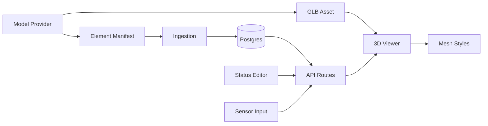

<!-- cspell:words glTF GLB Drei Revit BIM Infrafund upsert upserts Raycasting raycastable performant photorealistic GeoJSON SCADA Gantt Meshopt -->

# Task 120.1 — glTF Digital Twin Dashboard Plan

**Date:** 2026-05-11
**Status:** Draft
**Priority:** Medium
**Briefing:** `docs-dev/tasks/task-120-glTF-dashboard/task-120.0-glTF-dashboard-briefing.md`

## Summary

Build a digital twin dashboard for InfraFund energy projects that renders a provided glTF/GLB model and applies live project data from the application database. The model is treated as mostly static geometry; construction status, operational telemetry, and dashboard state are dynamic data fetched through Next.js API routes.

The first MVP should prove the full loop:

1. Load a provided energy project model in the browser.
2. Map stable model element IDs to database records.
3. Color, hide, highlight, and select model elements based on construction status.
4. Provide a simple authenticated status editor for project operators or general contractors.
5. Prepare the same model/data architecture for later operational telemetry.

## Goals

- Render provided glTF/GLB files in a Next.js page.
- Keep the data model generic so each new project/model does not require a new database schema.
- Preserve stable handles between the 3D model and database rows.
- Support construction-phase visualization with per-element status styling.
- Support a simple MVP data-provider UI for updating element statuses.
- Establish an operational-phase schema for time-series sensor readings.
- Document model-provider requirements separately so the 3D/model delivery can be validated before implementation.

## Non-goals

- Building or authoring the actual glTF/GLB model.
- Re-exporting the model whenever construction status changes.
- Full BIM authoring, clash detection, or engineering review features.
- Full SCADA/IoT integration in the first MVP.
- Complex schedule management in the first MVP beyond basic milestones/tasks.
- A custom model conversion pipeline in the first implementation.

## Recommended architecture

The core architectural principle is separation of geometry and data.

- **Geometry:** provided static `.glb` or `.gltf` asset hosted by the app or object storage.
- **Element registry:** database records for every trackable model element.
- **Construction state:** dynamic status records tied to element IDs.
- **Operational state:** time-series sensor readings tied to project assets or model elements.
- **Viewer:** React Three Fiber scene that maps database state onto model nodes at runtime.



## Frontend stack

Add these dependencies when implementation begins:

```sh
npm install three @types/three @react-three/fiber @react-three/drei
```

Recommended responsibilities:

- **Next.js App Router page:** dashboard shell, data fetching boundary, auth/authorization gate.
- **Client-only 3D viewer component:** owns React Three Fiber `<Canvas />` and model rendering.
- **Model loader component:** loads the GLB/GLTF with Drei `useGLTF`.
- **Element style mapper:** converts construction/operation state into material properties.
- **Selection panel:** shows metadata and current status for the selected element.
- **Legend/filter controls:** status colors, category filters, hide/show planned or completed elements.
- **Status editor:** simple table/list with dropdowns to update construction status.

All 3D components must be client components because Three.js relies on browser APIs.

## Viewer behavior

The viewer should load the static model and then apply database-driven styling to each mesh or node using its stable external ID.

Suggested construction statuses:

| Status | Meaning | Default visual style |
| --- | --- | --- |
| `not_started` | Planned but not begun | Grey, low opacity, optionally hidden |
| `planned_next` | Planned soon | Yellow |
| `in_progress` | Active construction | Blue |
| `installed` | Completed/installed | Green |
| `delayed` | Behind schedule | Red/orange |
| `blocked` | Cannot proceed | Red with strong emphasis |
| `not_applicable` | Not relevant for current view | Hidden or neutral |

The exact palette should later align with the product design system, but the semantic status names should remain stable.

### Material override approach

For MVP, prefer runtime material overrides over relying on glTF materials:

- Traverse the loaded scene.
- For each mesh, resolve a stable element ID from `node.name`, `mesh.name`, or metadata.
- Clone or replace the material so each element can be styled independently.
- Apply color, opacity, visibility, and emissive/outline effects based on the database status.

This avoids the common glTF problem where many meshes share the same material and one color change accidentally affects multiple parts.

### Interaction

- Use raycasting through React Three Fiber pointer events.
- On hover, show pointer cursor and optionally outline the element.
- On click, select the element and display its label, category, status, and metadata.
- Provide filters by status, category, level/zone, and construction package when this data exists in the manifest.

### Performance considerations

- Prefer `.glb` over `.gltf` for delivery.
- Optimize the model before upload; remove hidden/internal geometry that does not need web visualization.
- Keep interactive elements separate, but merge non-interactive decorative/static geometry when possible.
- Use lazy loading and Suspense loading states.
- Consider Draco or Meshopt compression if supported by the delivery pipeline.
- Consider instancing only for very large repeated geometries; it complicates per-element picking and styling.
- Add a model validation step that reports element count, missing IDs, duplicate IDs, triangle count, and asset size.

## Backend and database plan

The database should be model-independent. Each project gets rows, not schema changes.

### Proposed conceptual entities

| Entity | Purpose |
| --- | --- |
| `DigitalTwinProject` | One physical project/site, such as a wind farm or solar plant. |
| `DigitalTwinModel` | A specific model asset/version for a project. |
| `DigitalTwinElement` | Generic registry row for each trackable model element. |
| `DigitalTwinElementStatus` | Current construction status for an element. |
| `DigitalTwinStatusEvent` | Append-only history of status changes. |
| `DigitalTwinSensor` | Sensor/data point definition for operational telemetry. |
| `DigitalTwinSensorReading` | Time-series readings for sensors. |
| `DigitalTwinMilestone` | Optional high-level construction milestone/task. |

### Key identifiers

Use a stable provider-supplied external ID as the primary mapping handle. Preferred order:

1. IFC `GlobalId` when available.
2. Revit `UniqueId` when IFC ID is unavailable.
3. Provider-generated UUID only if it is stable across model revisions.

Do not use array index, mesh order, display label, or generated glTF node names unless the provider explicitly guarantees stability.

### Suggested schema shape

This is a conceptual shape for planning; final Prisma naming should follow existing project conventions.

```text
DigitalTwinProject
- id
- name
- projectType: wind | solar | geothermal | other
- locationJson
- status
- createdAt
- updatedAt

DigitalTwinModel
- id
- projectId
- version
- assetUrl
- manifestUrl
- sourceSystem: revit | ifc | speckle | blender | other
- sourceModelVersion
- unit
- upAxis
- checksum
- isActive
- createdAt

DigitalTwinElement
- id
- projectId
- modelId
- externalId
- displayName
- category
- parentExternalId
- level
- zone
- system
- constructionPackage
- metadataJson
- createdAt
- updatedAt

DigitalTwinElementStatus
- id
- elementId
- status
- plannedStartAt
- plannedFinishAt
- actualStartAt
- actualFinishAt
- updatedByUserId
- updatedAt

DigitalTwinStatusEvent
- id
- elementId
- previousStatus
- nextStatus
- note
- createdByUserId
- createdAt

DigitalTwinSensor
- id
- projectId
- elementId nullable
- key
- label
- unit
- sensorType
- metadataJson
- createdAt

DigitalTwinSensorReading
- id
- sensorId
- measuredAt
- value
- quality
- metadataJson
- receivedAt
```

### Status history

Keep both current status and event history:

- `DigitalTwinElementStatus` supports fast dashboard reads.
- `DigitalTwinStatusEvent` supports audit history, progress playback, and future timeline scrubbing.

### Manifest ingestion

The model provider should deliver a manifest file alongside the model. The app should ingest it with an upsert process:

1. Create or update the project model version.
2. Validate the manifest for required IDs and duplicates.
3. Upsert `DigitalTwinElement` rows by `projectId + externalId`.
4. Initialize missing element statuses to `not_started` or `planned_next`.
5. Report warnings for elements in the model that are missing from the manifest and manifest rows that are missing from the model.

## API plan

Initial API surface can stay small:

| Endpoint | Purpose |
| --- | --- |
| `GET /api/v1/digital-twin/projects/:projectId/model` | Return active model asset URL and model metadata. |
| `GET /api/v1/digital-twin/projects/:projectId/elements` | Return element registry and current statuses. |
| `PATCH /api/v1/digital-twin/elements/:elementId/status` | Update one element status. |
| `POST /api/v1/digital-twin/projects/:projectId/manifest` | Ingest/validate provider manifest. |
| `GET /api/v1/digital-twin/projects/:projectId/sensors` | Return operational sensor definitions. |
| `POST /api/v1/digital-twin/sensors/:sensorId/readings` | Add demo or real sensor reading. |
| `GET /api/v1/digital-twin/projects/:projectId/readings/latest` | Return latest operational readings for dashboard cards and model overlays. |

Implementation should use the existing server layering: route handlers call validation, services, repositories, and shared response/error helpers.

## Construction dashboard MVP

Minimum useful page:

- 3D viewer with orbit controls.
- Status legend.
- Element selection panel.
- Filters by status/category.
- Summary cards: total elements, installed count, in-progress count, delayed count.
- Status editor page or side panel with searchable element list and status dropdown.

Optional after the core loop works:

- High-level Gantt/milestone view.
- Timeline scrubber based on status event history.
- Progress percentages by construction package or zone.
- Snapshot export for investor reporting.

## Operation dashboard MVP

The operation phase should reuse the same digital twin model and element registry.

Initial high-level readings:

- Produced power in the last hour.
- Current production.
- Wind speed for wind projects.
- Solar irradiance for solar projects.
- Temperature or availability where relevant.

Minimum useful operation dashboard:

- 3D viewer with selected assets highlighted by sensor state.
- Latest sensor value cards.
- Simple manual demo input page for sensor readings.
- Latest-reading API and database persistence.
- Basic chart for recent readings per sensor.

Future production telemetry can later replace the manual input page without changing the viewer architecture.

## Access control

Use the existing app auth model when implementing:

- Investors can view published dashboards.
- Project operators/general contractors can update construction statuses.
- Admins can ingest manifests and manage model versions.
- Sensor ingestion endpoints should require authentication, signed tokens, or another explicit machine-to-machine guard before real external integrations are enabled.

## Implementation phases

### Phase 0 — Model contract and sample data

- Finalize provider guidance and manifest schema.
- Obtain a small sample GLB with stable IDs.
- Obtain a matching manifest file.
- Decide where model assets will be hosted for MVP: `public/`, Vercel blob/object storage, or another storage service.

### Phase 1 — Data foundation

- Add Prisma schema for project/model/element/status/history/sensor entities.
- Add service/repository functions for model metadata, elements, status updates, and sensor readings.
- Add manifest ingestion validation.
- Seed or import one demo project.

### Phase 2 — Construction viewer

- Add R3F dependencies.
- Build client-only model viewer.
- Traverse loaded model and map mesh IDs to element statuses.
- Apply material overrides and visibility rules.
- Add selection panel and status legend.

### Phase 3 — Status provider UI

- Build authenticated status editor.
- Add searchable/filterable element table.
- Add status dropdown and optional note field.
- Persist updates through API and refresh viewer state.

### Phase 4 — Operation telemetry MVP

- Add sensor definitions and readings.
- Add manual demo sensor input page.
- Add latest readings API.
- Render operational cards and simple charts.
- Optionally highlight model elements by warning/normal telemetry state.

### Phase 5 — Hardening

- Validate performance with realistic model size.
- Add access-control checks.
- Add ingestion reporting and model/manifest mismatch warnings.
- Add logging for ingestion and status changes.
- Add build/lint checks and any project-standard tests if test tooling exists by then.

## Open decisions

- Where production model assets should be stored.
- Whether the first model provider can supply IFC `GlobalId`, Revit `UniqueId`, or both.
- Whether one status should apply to each physical element or to grouped construction packages for the first MVP.
- Whether the investor-facing dashboard and operator status editor are separate routes or one route with role-based controls.
- Whether model versions should preserve historical element IDs across design revisions, and how to handle deleted/replaced elements.

## Risks

| Risk | Impact | Mitigation |
| --- | --- | --- |
| Model lacks stable IDs | Viewer cannot map database state to meshes | Make stable IDs a hard provider acceptance requirement. |
| Provider merges trackable objects | Individual parts cannot be styled or selected | Require trackable elements to remain separate in the model. |
| Shared materials cause bulk color changes | Wrong visual status display | Clone or replace materials per styled element. |
| Model is too large | Poor browser performance | Require optimization, GLB delivery, compression, and validation. |
| Schema becomes project-specific | Expensive onboarding for each new project | Use generic element registry plus JSON metadata. |
| Sensor model is overbuilt too early | Slows MVP | Start with manual readings and latest-value dashboard. |
| Access control is too loose | Unauthorized status changes | Reuse existing auth/session and role checks. |

## Definition of done for MVP

- A provided model can be rendered in a dashboard page.
- A manifest can populate generic element records.
- At least five construction statuses can be displayed with distinct visual styles.
- A selected mesh shows matching database metadata.
- A status update in the editor changes the database and updates the viewer without re-exporting the model.
- Initial sensor readings can be stored and shown in operation dashboard cards.
- Provider guidance is available and can be used as an acceptance checklist for future models.
