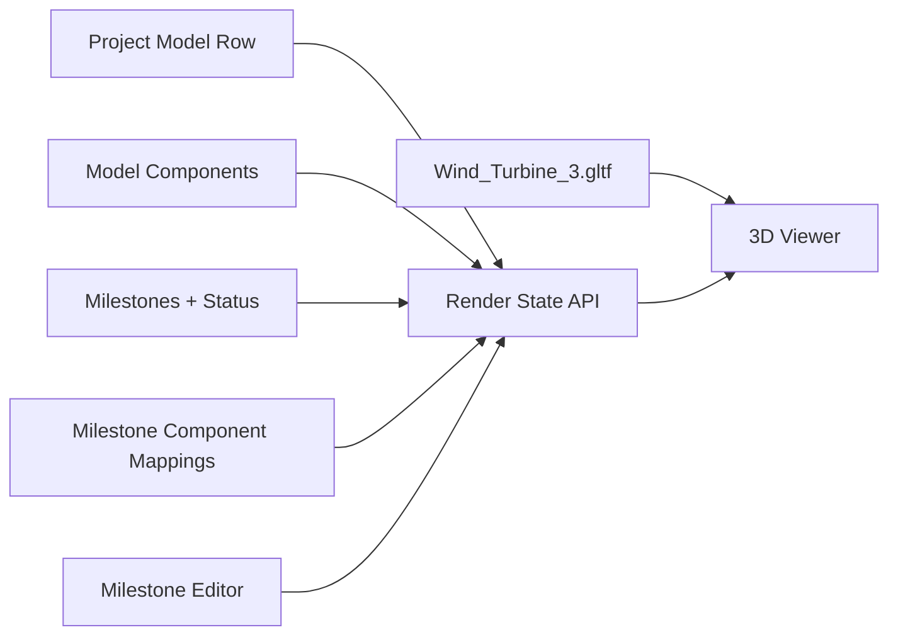

<!-- cspell:words glTF GLTF GLB Drei hardcoded hardwired Infrafund modelUrl upsert upserts Prisma raycastable componentized -->

# Task 124 — Database-Backed glTF Model Visibility

**Date:** 2026-05-13  
**Status:** Draft  
**Area:** Digital Twin / milestone-component persistence  
**Builds on:** `docs-dev/tasks/task-120-glTF-dashboard/task-121-glTF-model-visibility.md`

## Summary

Task 121 proved the frontend concept with hardwired state: `/projects/3/digital-twin` loads a componentized glTF model, milestone checkboxes map to model component node names, and completed milestones show their mapped components.

Task 124 turns that proof into a database-backed MVP. The model remains static geometry, while project model selection, trackable components, construction milestones, milestone-component mappings, and milestone statuses are stored in Postgres and exposed through the app's server layer.

## Goal

Users should be able to:

1. associate a project with a glTF model
2. create construction milestones
3. map each milestone to one or more model components
4. update milestone status in the database
5. open the digital twin render page and see component visibility/color derived from persisted milestone-component state

The same architecture should later support provider manifests, richer element status history, selection panels, and operational telemetry, but this task should focus on the milestone-to-component loop.

## MVP constraints

For the first database-backed implementation, do not build arbitrary model upload yet.

Use the known working componentized asset:

- `public/models/digital-twin/wind-turbine/Wind_Turbine_3.gltf`
- `public/models/digital-twin/wind-turbine/Wind_Turbine_3.bin`

The UI can present this as a selected model, but the implementation may hardcode it as the only selectable model for now.

Trackable component IDs available in this asset:

- `wind_turbine_T01_tower`
- `wind_turbine_T01_access_platform`
- `wind_turbine_T01_nacelle_hub`
- `wind_turbine_T01_blade_01`
- `wind_turbine_T01_blade_02`
- `wind_turbine_T01_blade_03`

Each ID is both the stable component external ID and the glTF node name used by the viewer.

## Non-goals

- Arbitrary user model upload.
- BIM authoring or model conversion.
- Re-exporting the model when milestone status changes.
- Full provider manifest ingestion.
- Full SCADA/IoT or operational telemetry.
- Complex construction scheduling beyond basic milestones.
- Replacing the project creation flow unless needed to seed the demo data.

## Architecture principle

Keep geometry and state separate.

- **Geometry:** static glTF/GLB asset served from `public/` for the MVP.
- **Project model record:** database row that points a project to a model asset/version.
- **Component registry:** database rows for trackable model components.
- **Milestones:** database rows owned by a project.
- **Milestone-component mapping:** join rows that connect milestones to one or more trackable components.
- **Render state:** server-computed DTO consumed by the 3D viewer.
- **Viewer:** React Three Fiber scene that maps render state onto glTF nodes at runtime.



## User flow

### 1. Milestone management page

On the milestone management page, a user can:

1. attach/select the project model, initially fixed to `Wind_Turbine_3.gltf`
2. see the model's available trackable components
3. create construction milestones
4. assign one or more components to each milestone
5. set or update each milestone's status
6. save all changes to the database

A milestone may map to:

- one component, such as `wind_turbine_T01_tower`
- many components, such as all three blade nodes

### 2. Digital twin render page

On `/projects/[id]/digital-twin`, the app should:

1. load the project model record
2. load milestones and mapped components
3. resolve component visibility/color from milestone status
4. load the static glTF asset
5. show/hide and color meshes using their node names
6. allow status updates if the current user has permission
7. refresh render state after a successful status update

## Status model

Use milestone status as the source of truth for this task.

Suggested initial statuses:

| Status | Meaning | Component behavior |
|---|---|---|
| `not_started` | Planned but not begun | hidden |
| `planned_next` | Planned soon | visible, yellow |
| `in_progress` | Active construction | visible, blue |
| `installed` | Completed/installed | visible, green |
| `delayed` | Behind schedule | visible, orange/red |
| `blocked` | Cannot proceed | visible, red |
| `not_applicable` | Not relevant for current view | hidden |

Minimum acceptable MVP fallback:

- `not_started` and `not_applicable` = hidden
- every other status = visible

If color styling is implemented in this task, clone or replace materials per mesh before applying colors so shared glTF materials do not accidentally update multiple components.

## Suggested Prisma data model

Final naming should follow existing repository conventions, but the database should remain project/model-independent.

### DigitalTwinModel

A selected model asset/version for a project.

```text
DigitalTwinModel
- id
- projectId
- name
- assetUrl
- format: gltf | glb
- version
- source
- unit nullable
- upAxis nullable
- isActive
- createdAt
- updatedAt
```

MVP seed/example:

```text
name: Wind Turbine 3
assetUrl: /models/digital-twin/wind-turbine/Wind_Turbine_3.gltf
format: gltf
version: 2026-05-13-v3-componentized
source: hardcoded_wind_turbine
isActive: true
```

### DigitalTwinModelComponent

A trackable component in the selected model.

```text
DigitalTwinModelComponent
- id
- modelId
- externalId
- displayName
- category
- nodeName
- parentExternalId nullable
- zone nullable
- system nullable
- constructionPackage nullable
- metadataJson nullable
- createdAt
- updatedAt
```

Constraints:

- `modelId + externalId` should be unique.
- `nodeName` should match the glTF node name for MVP.
- Do not use array indices, mesh order, or display labels as stable handles.

Seed components from `Wind_Turbine_3.gltf`:

| externalId | displayName | category | nodeName |
|---|---|---|---|
| `wind_turbine_T01_tower` | Tower | tower | `wind_turbine_T01_tower` |
| `wind_turbine_T01_access_platform` | Access platform | platform | `wind_turbine_T01_access_platform` |
| `wind_turbine_T01_nacelle_hub` | Nacelle and hub | nacelle | `wind_turbine_T01_nacelle_hub` |
| `wind_turbine_T01_blade_01` | Blade 01 | blade | `wind_turbine_T01_blade_01` |
| `wind_turbine_T01_blade_02` | Blade 02 | blade | `wind_turbine_T01_blade_02` |
| `wind_turbine_T01_blade_03` | Blade 03 | blade | `wind_turbine_T01_blade_03` |

### DigitalTwinMilestone

A construction milestone/task for a project.

```text
DigitalTwinMilestone
- id
- projectId
- label
- status
- sortOrder
- createdAt
- updatedAt
```

Possible `status` values:

```text
not_started
planned_next
in_progress
installed
delayed
blocked
not_applicable
```

### DigitalTwinMilestoneComponent

Join table between milestones and model components.

```text
DigitalTwinMilestoneComponent
- milestoneId
- componentId
- createdAt
```

Constraints:

- `milestoneId + componentId` should be unique.
- A milestone can map to one or more components.
- A component should usually belong to one active construction milestone for the MVP, but this does not need to be a hard constraint unless product requires it.

### Optional status event history

If inexpensive, add append-only history now. If not, defer to a follow-up.

```text
DigitalTwinMilestoneStatusEvent
- id
- milestoneId
- previousStatus
- nextStatus
- note nullable
- createdByUserId nullable
- createdAt
```

Current status supports fast reads; event history supports audit, playback, and later reporting.

## Server layering

Follow existing server architecture:

- `src/app/api/**` route handlers should stay thin.
- Validation should live in `src/server/validation`.
- Business logic should live in `src/server/services`.
- Prisma access should live in `src/server/repositories`.
- Responses/errors should use shared helpers from `src/server/http` where applicable.
- Do not import `src/server/**` directly into client components.

## API requirements

The exact route shape can be adjusted to match existing API conventions, but this task needs these operations.

| Endpoint | Purpose |
|---|---|
| `GET /api/v1/digital-twin/projects/:projectId/render-state` | Return model URL, milestones, components, and resolved component visual state. |
| `GET /api/v1/digital-twin/projects/:projectId/milestones` | List milestones and mapped components for editing. |
| `POST /api/v1/digital-twin/projects/:projectId/milestones` | Create a milestone. |
| `PATCH /api/v1/digital-twin/milestones/:milestoneId` | Update label, status, sort order, or mapped components. |
| `DELETE /api/v1/digital-twin/milestones/:milestoneId` | Delete a milestone and mappings. |
| `GET /api/v1/digital-twin/projects/:projectId/model-components` | List selectable components for the selected project model. |
| `POST /api/v1/digital-twin/projects/:projectId/seed-demo-model` | Optional dev-only/admin endpoint to attach `Wind_Turbine_3.gltf` and seed components. |

The render-state endpoint should be optimized for the viewer so the client does not reconstruct joins.

Example render-state response:

```json
{
  "model": {
    "id": "model-id",
    "assetUrl": "/models/digital-twin/wind-turbine/Wind_Turbine_3.gltf",
    "format": "gltf",
    "version": "2026-05-13-v3-componentized"
  },
  "milestones": [
    {
      "id": "milestone-id",
      "label": "tower install",
      "status": "installed",
      "components": ["wind_turbine_T01_tower"]
    }
  ],
  "components": [
    {
      "id": "component-id",
      "externalId": "wind_turbine_T01_tower",
      "displayName": "Tower",
      "nodeNames": ["wind_turbine_T01_tower"],
      "status": "installed",
      "visible": true,
      "color": "#24FF8E"
    }
  ]
}
```

## Frontend requirements

### Milestone management UI

The management UI should support:

- selected model display, initially fixed to `Wind_Turbine_3.gltf`
- component list with display name, category, and external ID
- milestone creation
- milestone status editing
- component assignment per milestone
- save/update/delete actions
- loading, empty, and error states

A basic implementation can be a table or card list. It does not need a sophisticated planner UI.

### Digital twin viewer page

The viewer page should support:

- loading render state from the server
- passing `model.assetUrl` into the existing glTF viewer
- passing component visual state into the viewer
- showing/hiding meshes based on `nodeNames`
- preventing hidden meshes from casting shadows
- applying status colors if material override is implemented
- refreshing render state after milestone status updates

### Viewer implementation notes

- The viewer is a client component because Three.js uses browser APIs.
- Load the model with Drei `useGLTF`.
- Traverse the loaded scene.
- Resolve a mesh's component by checking its own name and parent names against `nodeNames`.
- Set `object.visible`, `object.castShadow`, and `object.receiveShadow` from resolved visibility.
- If coloring, clone/replace the mesh material before mutating it.
- Keep `<Suspense />`, loading UI, orbit controls, and bounds fitting from the current viewer.

## Seed/demo data

For project `3`, seed a useful default demo:

| Milestone | Status | Components |
|---|---|---|
| tower install | `installed` or `not_started` | `wind_turbine_T01_tower` |
| access platform install | `not_started` | `wind_turbine_T01_access_platform` |
| nacelle and hub mount | `not_started` | `wind_turbine_T01_nacelle_hub` |
| blade installation | `not_started` | all three blade components |

This ensures the MVP demonstrates both:

- milestone `<1:1>` component mapping
- milestone `<1:n>` component mapping

## Access control

Use the existing app auth model.

Suggested policy:

- investors can view published dashboards
- project operators/general contractors can update construction milestone status
- admins can attach/seed models and manage component registries

Do not expose mutation endpoints without authentication/authorization checks.

## Implementation phases

### Phase 1 — Data foundation

- Add Prisma schema for model, component, milestone, mapping, and optional status event entities.
- Generate Prisma client.
- Add repository functions for models, components, milestones, mappings, and render-state reads.
- Add service functions for seeding the known model, saving milestones, updating status, and building render state.
- Add validation schemas for milestone create/update/status payloads.

### Phase 2 — Demo model seeding

- Attach `Wind_Turbine_3.gltf` to project `3`.
- Seed the six known trackable components.
- Seed default milestones and mappings.
- Ensure seed/upsert behavior is idempotent.

### Phase 3 — API routes

- Add render-state read endpoint.
- Add milestone list/create/update/delete endpoints.
- Add model component list endpoint.
- Add dev/admin-only seed endpoint if needed.
- Use consistent error responses.

### Phase 4 — Milestone management UI

- Build the model/component/milestone editor UI.
- Allow selecting components for each milestone.
- Allow changing milestone status.
- Persist changes through API.

### Phase 5 — Database-backed render page

- Replace project `3` hardwired milestone state with server render state.
- Keep the existing viewer but feed it persisted component visual state.
- Add mutation handling for status changes if editing is allowed on the render page.
- Refresh render state after updates.

### Phase 6 — Hardening

- Add access-control checks.
- Add logging around status changes and seed/import operations.
- Add validation for missing component node names.
- Run lint/build checks.
- Add tests if/when test tooling exists for this area.

## Acceptance criteria

- Project `3` can be associated with `Wind_Turbine_3.gltf` in persisted data.
- The six known trackable model components are stored with stable external IDs.
- A user can create milestones and map them to one or more components.
- At least one milestone maps to a single component.
- At least one milestone maps to multiple components.
- Milestone status updates are saved to the database.
- The digital twin render page derives visibility from database state, not hardwired local state.
- Hidden components do not cast shadows.
- Visible components can be colored by status, or the MVP explicitly falls back to visible/hidden behavior only.
- The implementation follows the existing server layering and avoids importing server modules into client components.

## Risks and mitigations

| Risk | Impact | Mitigation |
|---|---|---|
| Model component IDs drift from database rows | Viewer cannot map status to meshes | Keep `externalId` and `nodeName` seeded from `Wind_Turbine_3.gltf`; validate missing names. |
| Shared glTF materials affect multiple components when colored | Wrong visual state | Clone/replace material per mesh before applying status color. |
| Milestone-to-component mapping becomes project-specific | Hard to reuse | Store generic model components and join rows, not project-specific columns. |
| API returns raw joins that the client must reconstruct | Fragile viewer logic | Add a render-state service that resolves visual state server-side. |
| Mutation endpoints are too permissive | Unauthorized status edits | Reuse existing auth/session and role checks. |
| Arbitrary upload scope creeps into MVP | Delays proof | Hardcode/select only `Wind_Turbine_3.gltf` for this task. |

## Open decisions

- Whether task 124 should include material color overrides or only persisted visibility.
- Whether the milestone management UI should live on the existing project page or a separate route.
- Whether to add status event history now or defer it.
- Whether a component can belong to more than one active milestone in the first MVP.
- Which roles are allowed to attach/seed the model for a project.

## Notes

The broader digital twin plan includes provider manifest ingestion, element-level status history, selection panels, filters, and operational telemetry. This task intentionally extracts only what is needed to move the working hardwired milestone-component visibility proof into persisted database state.
