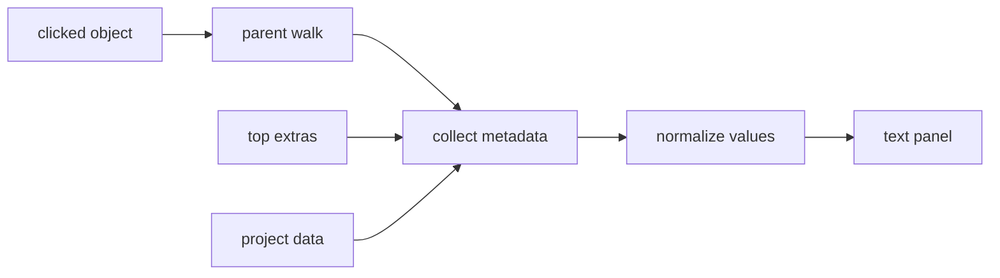

<!-- cspell:words glTF glTFs GLB R3F drei externalId trackable userData nodeNames jsonb colorOverride fitout componentized -->

# v1.2.7 — GLTF Click-to-Inspect Component Metadata

## Summary

Enable users to click a component in the `/projects/1/digital-twin` 3D viewer and see metadata from the loaded model as plain name-value pairs. This first milestone should be model-agnostic: it must work with the current componentized `Wind_Turbine_3.gltf`, but it should not require a fixed schema for future glTF/GLB assets.

## Principle

Do not map arbitrary model metadata into fixed application variables for the first pass. Different models may expose different metadata keys under node `extras`, mesh `extras`, material metadata, top-level `extras`, or loader-derived `userData`.

Use generic metadata records and display whatever is available:

```ts
type MetadataValue =
  | string
  | number
  | boolean
  | null
  | MetadataValue[]
  | { [key: string]: MetadataValue };

type MetadataRecord = Record<string, MetadataValue>;
```

Only use a small set of optional identity keys for matching and panel headings when present:

- `externalId`
- `id`
- `name`
- `displayName`
- `modelNodeName`

Everything else should render as plain text key-value rows. Nested arrays/objects can render as compact JSON text in the first milestone.

## Current model metadata example

`Wind_Turbine_3.gltf` has six trackable components:

- `wind_turbine_T01_nacelle_hub`
- `wind_turbine_T01_tower`
- `wind_turbine_T01_access_platform`
- `wind_turbine_T01_blade_01`
- `wind_turbine_T01_blade_02`
- `wind_turbine_T01_blade_03`

These components currently expose keys such as:

- `externalId`
- `displayName`
- `category`
- `modelNodeName`
- `trackable`
- `parentExternalId`
- `level`
- `zone`
- `system`
- `constructionPackage`
- `defaultStatus`

Some values are shared across all current wind-turbine leaf components (`trackable`, `parentExternalId`, `level`, `zone`, `defaultStatus`), and some differ (`externalId`, `displayName`, `category`, `modelNodeName`, `system`, `constructionPackage`). This should be treated as current data, not as a required application schema.

Additional metadata may exist on meshes (`extras.externalId`, `extras.trackable`), mesh primitives (`extras.externalId`), materials (`name`, `extras.sourceMaterialIndex`, `extras.trackableExternalId`), assembly group nodes (`wind_turbine_T01`, `wind_turbine_T01_rotor`), and top-level `extras.model`.

## Minimal first milestone — completed

Implemented client-side click inspection from the already-loaded glTF scene.

### Tasks

- [x] Add generic metadata TypeScript types in `src/lib/digital-twin-projects.ts`.
- [x] Pass optional `project.components` from `src/components/digital-twin/client-page.tsx` into `DigitalTwinModelViewer` as supplemental metadata, not as the only source of truth.
- [x] Add selected metadata state to `src/components/digital-twin/model-viewer.tsx` as `MetadataRecord | null`.
- [x] Add an R3F click handler that inspects `event.object`.
- [x] Walk up the clicked object's parent chain and collect available metadata from each level:
  - object name
  - object type
  - `object.userData`
  - parent names
  - parent `userData`
- [x] If an identity key is found, try to match against `project.components` and/or `gltf.parser.json.extras.elements`, then merge that metadata into the display record.
- [x] Merge metadata in a predictable order:
  1. clicked object metadata
  2. parent-chain metadata
  3. project component metadata, when matched
  4. top-level glTF catalog metadata, when matched
- [x] Add a side panel component that displays selected metadata as plain key-value text.
- [x] Show an empty state when no component is selected: `Click a component to inspect`.
- [x] Add hover cursor feedback for clickable model objects.
- [x] Preserve existing construction milestone visibility behavior for project 2.
- [x] Add a responsive metadata panel with viewport/sidebar split, compact rows, themed scrollbar, and mobile stacking.
- [x] Add responsive header and mobile sidebar drawer support for narrow screens.

### Proposed data flow



### Files likely to change

| File | Purpose |
| --- | --- |
| `src/components/digital-twin/model-viewer.tsx` | Add click handling, hover cursor feedback, metadata collection, selected metadata state. |
| `src/components/digital-twin/client-page.tsx` | Pass supplemental component config into the viewer and arrange viewer/panel layout. |
| `src/components/digital-twin/component-inspector.tsx` | New simple metadata side panel. |
| `src/lib/digital-twin-projects.ts` or `src/lib/digital-twin-types.ts` | Add generic metadata types. |

### Acceptance criteria

- [x] Clicking the tower shows the metadata attached to that model object.
- [x] Clicking the nacelle/hub shows the metadata attached to that model object.
- [x] Clicking each blade shows metadata for the matching clicked blade.
- [x] Clicking the access platform shows metadata for the matching clicked object.
- [x] The inspector can display arbitrary unknown keys without code changes.
- [x] Nested values render safely as compact text/JSON.
- [x] Existing project 1 energy metrics still render.
- [x] Existing project 2 construction milestone visibility still works.
- [x] `npm run format:lint` passes.
- [x] `npm run format:cspell` passes.
- [x] `npm run build` passes.

## Follow-up phases

### Phase 2 — Database-backed arbitrary component properties

Keep the glTF/bin files as render assets and store editable business data in PostgreSQL keyed by model identity fields such as `externalId`, `id`, or stable node name.

The existing schema already has:

- `ProjectDigitalTwinModel`
- `ProjectDigitalTwinComponent`
- `ProjectCreationMilestoneComponent`

Prefer flexible storage first:

```prisma
metadata Json? @db.JsonB
```

Promote fields such as `status` or `colorOverride` to first-class columns only when they need indexing, filtering, or frequent updates:

```prisma
status        String? @db.VarChar(50)
colorOverride String? @map("color_override") @db.VarChar(20)
```

Tasks:

- [ ] Add `metadata Json? @db.JsonB` to `ProjectDigitalTwinComponent`.
- [ ] Import discovered model metadata into `metadata` without requiring fixed keys.
- [ ] Load component metadata server-side for `/projects/[id]/digital-twin`.
- [ ] Merge database metadata with glTF metadata, with database values taking precedence.
- [ ] Display DB-backed fields in the same generic inspector panel.
- [ ] Later promote heavily queried keys to typed columns.

### Phase 3 — Selection highlight and status colors

Add visual feedback in the model without editing the glTF asset.

Tasks:

- [ ] Highlight the selected object or resolved component by cloning or temporarily overriding its material.
- [ ] Support optional runtime color metadata such as `color`, `colorOverride`, or a status-to-color mapping when present.
- [ ] Reset materials safely when selection changes or the component is deselected.
- [ ] Avoid assuming every model uses the same material structure.

### Phase 4 — Editable metadata panel

Turn the simple read-only panel into a richer panel for operational workflows while keeping arbitrary metadata support.

Tasks:

- [ ] Display all metadata as generic key-value rows by default.
- [ ] Add optional enhanced renderers for recognized keys such as status, dates, URLs, documents, or sensor readings.
- [ ] Add API routes or server actions for updating component metadata.
- [ ] Add permission checks before allowing edits.
- [ ] Add optimistic UI for metadata changes.
- [ ] Add audit logging for metadata updates.

### Phase 5 — Multi-model and multi-asset support

Support projects with several models or several turbines in one model.

Tasks:

- [ ] Store a model-level identity namespace for each loaded asset.
- [ ] Load metadata catalogs per active model.
- [ ] Resolve clicks across multiple loaded scenes.
- [ ] Add a model selector when multiple digital twin assets are active.
- [ ] Keep metadata rendering generic so different models can expose different key sets.
