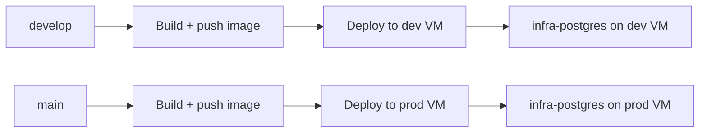

<!-- cspell:words uuidv7 uuidv sslmode prebuild ACR acr infrafund infrafunds dumb DEVBUILD PRODBUILD DEVDEPLOY PRODDEPLOY DEVPG PRODPG baselining -->

# Deploying InfraFund to Azure

This project deploys as a Docker container built and pushed to Azure Container
Registry (ACR), then run via Docker Compose on self-hosted Azure VMs. There is
no Vercel or Neon in this pipeline — Postgres runs as its own container
(`infra-postgres`) on each VM, reachable by the app container over a shared
Docker network.

## Topology



| Git branch | Workflow | Image tag | Target VM | Domain |
| --- | --- | --- | --- | --- |
| `develop` | `.github/workflows/deploy-dev.yaml` | `infra-dashboard:dev` | dev self-hosted runner | `dash-dev.infrafund.net` |
| `main` | `.github/workflows/deploy.yaml` | `infra-dashboard:prod` | prod self-hosted runner | `dash.infrafund.net` |

Each workflow: builds the Docker image (`deployment/Dockerfile`) → pushes to
`infrafund.azurecr.io` → runs `prisma migrate deploy` against the target
Postgres inside a throwaway container on the `internal` Docker network → writes
runtime secrets to a temp env file → `docker compose up -d --force-recreate` →
waits for the container health check → cleans up the temp env file.

## Current repo state

- `prisma/schema.prisma` — source-of-truth Prisma data model
- `prisma/migrations/` — committed Prisma migrations, replayed by `prisma migrate deploy` at deploy time
- `scripts/ensure-uuidv7.mjs` — ensures `uuidv7()` works regardless of Postgres version (built-in on 18+, installs `pg_uuidv7` on older versions)
- `scripts/setup-remote-db.mjs` — `ensure-uuidv7` → `prisma migrate deploy` → `seed-countries`, for manually bringing up a fresh remote database
- `scripts/seed-countries.mjs` — idempotent country reference-data seed
- `scripts/check-prisma-migration-sync.mjs` — CI guard for schema-without-migration drift
- `.github/workflows/prisma-migration-guard.yaml` — enforces committed migrations on PRs and pushes to `develop`/`main`
- `deployment/docker-compose.yml` / `docker-compose.dev.yml` — the compose files copied onto the prod/dev VMs by `deployment/vm-setup.sh`
- `deployment/vm-setup.sh` — one-time VM bootstrap (Docker, ACR login, nginx, GitHub Actions runner registration)

## Required GitHub secrets

| Secret | Used by |
| --- | --- |
| `ACR_USERNAME` / `ACR_PASSWORD` | Both workflows — ACR login |
| `PRIVY_APP_ID` / `PRIVY_APP_SECRET` | Both workflows — shared across environments |
| `RECAPTCHA_SITE_KEY` | `deploy.yaml` (prod) |
| `DEV_RECAPTCHA_SITE_KEY` | `deploy-dev.yaml` |
| `DATABASE_URL` | `deploy.yaml` — prod Postgres connection string |
| `DEV_DATABASE_URL` | `deploy-dev.yaml` — dev Postgres connection string |
| `APP_JWT_SECRET` | `deploy.yaml` |
| `DEV_APP_JWT_SECRET` | `deploy-dev.yaml` |
| `AZURE_STORAGE_CONNECTION_STRING` / `AZURE_STORAGE_CONTAINER_NAME` | `deploy.yaml` — prod proposal-document storage |
| `DEV_AZURE_STORAGE_CONNECTION_STRING` / `DEV_AZURE_STORAGE_CONTAINER_NAME` | `deploy-dev.yaml` — dev proposal-document storage |

`DATABASE_URL`/`DEV_DATABASE_URL` should point at the `infra-postgres`
container already running on each VM (reachable over the `internal` Docker
network via the `postgres` hostname alias), not at any external
Neon/hosted-Postgres provider.

## Bringing up a fresh database

Against any Postgres instance with `DATABASE_URL` set:

```sh
npm run db:remote:setup
```

This runs `ensure-uuidv7.mjs` → `prisma migrate deploy` → `seed-countries.mjs`.
Individual steps are also available as `db:remote:bootstrap` and
`db:remote:migrate`.

## Local development

`npm run dev:local` brings up `deployment/docker-compose.local.yml` (a local
`postgres:18-alpine` container) and runs the dev server against it — this path
is unaffected by anything above.

## Troubleshooting checklist

1. Inspect the GitHub Actions run logs for the `build` and `deploy` jobs first.
2. Confirm `secrets.DATABASE_URL` / `secrets.DEV_DATABASE_URL` resolve to the
   VM's `infra-postgres` container, not a stale external host.
3. Confirm `prisma/migrations/` contains a committed migration for any schema
   change (the migration guard workflow should already have caught this on
   the PR).
4. If the container fails its health check, check
   `docker compose -f deployment/docker-compose.yml logs dashboard` (or the
   `.dev.yml` equivalent) on the VM.
5. If `prisma migrate deploy` fails with `P3005` (schema exists, no migration
   history), do not blindly reset — inspect the target database's actual
   state before baselining or wiping it, especially in prod.
6. Never add an automatic `prisma migrate resolve --applied` fallback to a
   deploy workflow. It marks a migration as applied without running its SQL,
   so it "succeeds" even when the real cause of failure is a missing table —
   the next migration then breaks against a database that doesn't actually
   match what `_prisma_migrations` claims. This exact pattern in
   `deploy-dev.yaml` silently skipped 8 of `20260513143000_init`'s tables
   (the whole `projects`/`project_*` domain) for months; both workflows now
   run a plain `prisma migrate deploy` with no fallback, and any failure
   should be root-caused by hand, not auto-resolved.
