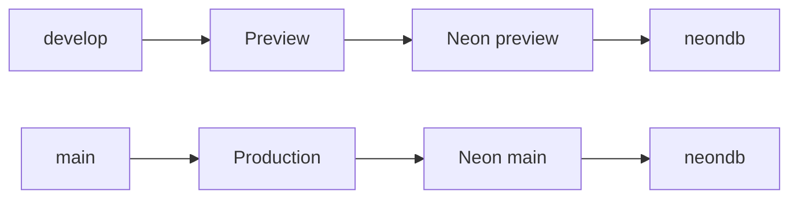

<!-- cspell:words neondb Neon uuidv7 uuidv pooler sslmode prebuild UNPOOLED replayable baselined branch-scoped devops infrafunds -->

# Deploying InfraFund to Vercel with Neon Postgres

This project is deployed as a single Vercel project backed by Neon Postgres. The
recommended setup is to keep Preview and Production isolated by using separate
Neon branches and branch-scoped Vercel environment variables.

## Recommended topology

Use one Neon project with separate branches for the Vercel environments:



Recommended mapping:

| Git / Vercel target | Neon branch       | Database | Owner          | Purpose                         |
| ------------------- | ----------------- | -------- | -------------- | ------------------------------- |
| `develop` / Preview | `preview/develop` | `neondb` | `neondb_owner` | Test preview schema and app     |
| `main` / Production | `main`            | `neondb` | `neondb_owner` | Production schema and live data |

This is still one Vercel project and one Neon project, but Preview and Production
must resolve to different Neon branch hosts. Do not let Preview and Production
share the same `DATABASE_URL` unless you intentionally want migrations from both
environments to run against the same database.

## Current repo state

This repository contains the Vercel/Neon schema-sync pieces:

- `prisma/schema.prisma` — source-of-truth Prisma data model
- `prisma/migrations/` — committed Prisma migrations that Vercel replays
- `scripts/bootstrap-neon-db.mjs` — ensures `uuidv7()` works on Neon/Postgres 17
- `scripts/vercel-build.mjs` — Vercel build entrypoint for schema sync
- `scripts/seed-countries.mjs` — idempotent country seed
- `scripts/check-prisma-migration-sync.mjs` — CI guard for schema-without-migration drift
- `.github/workflows/prisma-migration-guard.yaml` — enforces committed migrations on PRs and pushes to `develop` and `main`

Expected deployment behavior:

- push to `develop` → Vercel Preview deploy → Neon `preview/develop`
- push to `main` → Vercel Production deploy → Neon `main`
- each deploy runs the schema-sync pipeline before `next build`

## Vercel build pipeline

Vercel must use this build command:

```sh
npm run vercel-build
```

That command executes `scripts/vercel-build.mjs`, which runs:

```sh
npx prisma generate
node scripts/bootstrap-neon-db.mjs
npx prisma migrate deploy
node scripts/seed-countries.mjs
next build
```

What each step does:

1. `prisma generate` refreshes the Prisma client.
2. `bootstrap-neon-db.mjs` installs `pg_uuidv7` if needed and creates the `uuidv7()` alias.
3. `prisma migrate deploy` replays unapplied committed migrations against the target database.
4. `seed-countries.mjs` seeds countries only if missing.
5. `next build` builds the app only after the database is ready.

## Prerequisites

- Vercel account/team with access to the `front-pro` project
- GitHub repo connected to Vercel
- Neon account/org connected to the Vercel account/team
- Third-party credentials listed in `config-operation/environment-variables.md`

## CLI access for agent-run operations

If you want an agent to inspect or change Vercel/Neon configuration, provide a
terminal where both CLIs are already authenticated to the intended accounts:

```sh
vercel whoami
neon me
```

The agent should use the authenticated Neon CLI to inspect branches, databases,
roles, and connection strings. Do not try to recover the Neon database URL or
password from Vercel; that is unnecessary and may not work. The Neon CLI can
derive the needed connection string for the selected Neon project, branch,
database, and role.

If `neon me` shows the wrong account, or Neon auth fails, stop automation and ask
the user to complete the OAuth login flow manually:

```sh
neon login
```

After the user confirms login completed, rerun `neon me` and continue only if it
shows the expected Neon account/org.

## Step 1 — Create or connect the Vercel project

1. In Vercel, click **Add New → Project**.
2. Import the `front-pro` GitHub repository.
3. Set **Root Directory** to `/`.
4. Configure env vars before relying on deployments.
5. Confirm the project build command is `npm run vercel-build`.

CLI verification:

```sh
npx vercel project inspect front-pro --scope <vercel-team-slug>
```

## Step 2 — Create or connect the Neon project

Use a Neon project with at least these branches:

- `main`
- `preview/develop`

Each branch should contain a `neondb` database owned by `neondb_owner`.

Useful read-only checks:

```sh
neon projects list --org-id <neon-org-id>
neon branches list --project-id <neon-project-id>
neon databases list --project-id <neon-project-id> --branch <branch-id-or-name>
```

If `preview/develop` does not exist, create it from `main` in the Neon console or
with the Neon CLI. Then verify `neondb` exists on that branch.

## Step 3 — Configure Vercel environment variables

Add all required application variables from `config-operation/environment-variables.md`.
The database variable must be scoped correctly:

| Vercel environment | Git branch | `DATABASE_URL` target         |
| ------------------ | ---------- | ----------------------------- |
| Production         | `main`     | Neon `main` branch            |
| Preview            | `develop`  | Neon `preview/develop` branch |

Production should use the Neon `main` branch connection string. The `develop`
Preview should have a branch-scoped override that points to the Neon
`preview/develop` branch.

Example for the `develop` Preview override:

```sh
url=$(neon connection-string preview/develop \
  --project-id <neon-project-id> \
  --database-name neondb \
  --role-name neondb_owner \
  --pooled \
  -o json | tr -d '"')

printf '%s\n' "$url" | npx vercel env add DATABASE_URL preview develop \
  --scope <vercel-team-slug> \
  --sensitive \
  --force \
  --yes
```

Use the Neon `main` branch connection string for Vercel Production.

Important:

- Preview and Production must not resolve to the same Neon host.
- A manually defined shared `DATABASE_URL` can override the Neon integration and defeat isolation.
- Vercel environment labels alone do not prove database isolation; verify the actual resolved host.

## Step 4 — Verify Preview and Production isolation

Sanitize outputs before sharing them. You only need to compare host/database/user;
do not print passwords.

Example sanitized check:

```sh
neon connection-string main \
  --project-id <neon-project-id> \
  --database-name neondb \
  --role-name neondb_owner \
  --pooled

neon connection-string preview/develop \
  --project-id <neon-project-id> \
  --database-name neondb \
  --role-name neondb_owner \
  --pooled
```

Expected result:

- Production resolves to the Neon `main` branch host.
- `develop` Preview resolves to the Neon `preview/develop` branch host.
- Both can use database name `neondb` and owner `neondb_owner`, because branch isolation separates them.

## Step 5 — Deploy Preview

Push or redeploy `develop`:

```sh
npx vercel redeploy <deployment-id-or-url> --target preview --scope <vercel-team-slug>
```

Then inspect the logs:

```sh
npx vercel inspect <preview-url> --logs --wait --timeout 6m --scope <vercel-team-slug>
```

Confirm the logs show:

- `Running "npm run vercel-build"`
- datasource host is the Neon `preview/develop` host
- `Applying migration ...` or `All migrations have been successfully applied`
- `Deployment completed`
- final status is `Ready`

## Step 6 — Promote tested schema changes to Production

Use merge-to-`main` as the production path for schema-changing releases.

Recommended workflow:

1. Change `prisma/schema.prisma` locally.
2. Generate a migration:

   ```sh
   npx prisma migrate dev --name <change-name>
   ```

3. Commit all schema artifacts:
   - `prisma/schema.prisma`
   - the new folder under `prisma/migrations/`
   - any generated code changes that belong with the migration
4. Push to `develop` and let Vercel Preview run `npm run vercel-build`.
5. Verify Preview succeeds against Neon `preview/develop`.
6. Review whether the migration is destructive.
7. Before destructive or high-risk production migrations, create a Neon backup/snapshot branch from `main`.
8. Merge `develop` into `main`.
9. Let Vercel Production run a fresh build, including `prisma migrate deploy`, against Neon `main`.
10. Inspect Production logs and verify the app.

Do not rely on Vercel **Promote to Production** for schema-changing releases. A
promotion can reuse Preview build output and is not the same as running a fresh
Production build/migration against the Neon `main` branch.

## Account alignment notes

### Current InfraFund Vercel account

The current `infrafunds-projects/front-pro` setup should follow this mapping:

- Vercel Production → Neon `main`
- Vercel `develop` Preview → Neon `preview/develop`

The `develop` Preview database can be reset independently without touching
Production.

### `sum` Vercel account

The earlier `sum` account reset process is still valid. Also verify the final
configuration there:

- If Preview and Production already use separate Neon branches, no change is needed.
- If Preview and Production share one `DATABASE_URL`, update the `develop` Preview to use a branch-scoped Neon `preview/develop` override.
- Keep Production pointed at Neon `main`.

The goal for both accounts is the same: Preview and Production deployments should
use separate Neon branch hosts.

## Resetting a broken Preview database

Use this when Preview data is disposable and `prisma migrate deploy` fails with
`P3005` because the database already contains tables but lacks Prisma migration
history.

Example failure:

```text
Error: P3005
The database schema is not empty.
```

Reset flow:

1. Identify the Neon project ID.
2. Identify the `preview/develop` branch ID.
3. Confirm the database name and owner.
4. Delete the database on the preview branch.
5. Recreate the same database name and owner.
6. Redeploy Preview from Vercel.

Commands:

```sh
neon projects list --org-id <neon-org-id>
neon branches list --project-id <neon-project-id>
neon databases list --project-id <neon-project-id> --branch <preview-branch-id>

neon databases delete neondb \
  --project-id <neon-project-id> \
  --branch <preview-branch-id>

neon databases create \
  --project-id <neon-project-id> \
  --branch <preview-branch-id> \
  --name neondb \
  --owner-name neondb_owner

npx vercel redeploy <deployment-id-or-url> --target preview --scope <vercel-team-slug>
```

Notes:

- Deleting the database removes all data in that preview database.
- Recreating the database keeps the Neon branch but starts the database fresh.
- Production is untouched as long as the branch is `preview/develop`, not `main`.
- After redeploy, Vercel reruns bootstrap, migrations, seed, and app build.

## Troubleshooting checklist

If deployment fails:

1. Inspect Vercel build logs first.
2. Confirm the deployment used the intended Neon host.
3. Confirm the Vercel build command is `npm run vercel-build`.
4. Confirm `prisma/migrations/` contains a committed migration for schema changes.
5. Run `prisma migrate status` against the actual target database if needed.
6. If Preview fails with `P3005`, reset only the Preview database.
7. If Production fails with `P3005`, stop and decide whether to baseline, restore, or manually migrate; do not wipe Production unless explicitly planned.

## Postgres version note

`uuidv7()` availability differs by Postgres version:

| Environment                        | Postgres version | `uuidv7()` source                |
| ---------------------------------- | ---------------- | -------------------------------- |
| Local Docker (`npm run dev:local`) | 18.x             | Built-in `pg_catalog`            |
| Neon / Vercel                      | 17.x             | `pg_uuidv7` extension plus alias |

`bootstrap-neon-db.mjs` detects whether `uuidv7()` already exists and only
installs the extension/alias when needed.

## Summary

The safe deployment model is:

- `develop` Preview tests schema changes on Neon `preview/develop`.
- `main` Production applies tested committed migrations on Neon `main`.
- Preview resets are allowed when disposable.
- Production schema changes happen through a fresh Production build after merge to `main`.
